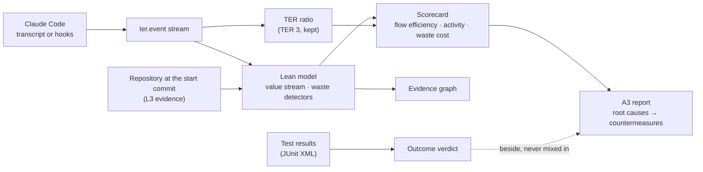

# TER

[](https://github.com/lgriffin/TER/actions/workflows/ci.yml)
[](LICENSE)

TER analyses AI coding sessions (today, Claude Code sessions) to show how
efficiently an agent turned a developer's intent into working software, where
it wasted effort, and what to change so the next session wastes less.

It started as the **Token Efficiency Ratio**: the share of the tokens an agent
generated that were aligned with what the developer asked. **TER 4** keeps
that ratio and builds a Lean analysis platform around it: every session
becomes a value stream of events, waste is classified and traced to evidence,
and an A3 report turns findings into concrete countermeasures for
`CLAUDE.md`, Claude Code hooks and settings.

> TER is a heuristic, decision-support tool. Its numbers are signals to
> investigate, not verdicts on a developer, a model or a session.

## TER 4 at a glance



- **Two packages, one install.** `ter_calculator` is TER 3, the original
  calculator behind `ter analyze`. `ter` is TER 4, a hexagonal
  (ports-and-adapters) rebuild that wraps TER 3 and replaces it piece by
  piece without changing its scores.
- **One event stream.** Transcripts and live hooks become the same
  `ter.event` stream, and live analysis equals batch analysis.
- **Lean, with evidence.** Each event is value-adding, necessary
  non-value-adding or avoidable; every waste finding cites the events it
  rests on and publishes its confidence rule. Uncertain findings are shown,
  never counted.
- **Controlled by requirements.** Every behaviour is an EARS requirement
  traced to tests and gated in CI, under a 200-point vision with a definition
  of done per point.
- **Behaviour apart from outcome.** Test results (JUnit XML) give a verdict,
  accepted, rejected or incomplete, shown beside the Lean measures and never
  folded into them.
- **Open to capability packs.** Adapters for every port are registered by
  `ter.capabilities` entry points, so another project can add a session
  source, tokenizer or outcome source without forking TER
  ([ADR 0005](docs/decisions/0005-admitting-external-capabilities.md)).
- **Real data, redacted first.** Real sessions enter only through a corpus
  importer that redacts secrets, paths and file contents before anything is
  written, and hook payloads can be recorded to calibrate the live path.

### Maturity levels

TER 4 is delivered in seven levels. A level is claimed only when every
requirement at that level is verified by a passing test. **L0 to L3 are met:
TER 4 is at L3 Grounded**, and L4 Advisory is next. The
[strategy and maturity roadmap](docs/ter4/strategy.md) says what was checked
on real sessions, what is still unproven, and how L4 to L6 will be built.

| Level | Name | Adds | Status | Requirements verified | Points done / partial / not started |
|---|---|---|---|---:|---:|
| L0 | Measured | TER 3 parity inside the hexagon: event contract, scoring, dated prices, no intervention below L4 | Met; CI gate | 25 of 25 | 10 / 1 / 0 |
| L1 | Observed | Event stream as the core boundary, Claude Code hooks (Stop and SubagentStop included), hook recorder, live = batch | Met; CI gate; hook ids checked on real recordings | 22 of 22 | 15 / 1 / 0 |
| L2 | Explained | Lean model, waste detectors, evidence graph, scorecard, A3, outcome verdict, redacted corpus import | Met; CI gate; detectors calibrated on real sessions | 54 of 54 | 49 / 5 / 0 |
| L3 | Grounded | Repository evidence (symbols, imports, tests, call edges, Git), change surface, architecture contracts, context bundles, advisory routing | Met; gated in CI | 34 of 34 | 25 / 23 / 0 |
| L4 | Advisory | Intervention engine, declarative policies, ledger | Next | 0 of 16 | 0 / 5 / 34 |
| L5 | Corrective | Calibration, benchmarks, opt-in corrective actions | Not started | 0 of 10 | 1 / 4 / 8 |
| L6 | Learning | Closed loop, second harness, research datasets | Second harness (GARE) and stack comparison built | 11 of 19 | 1 / 4 / 14 |

Points that need real session data stay partial until real sessions confirm
them. Live numbers: `ter-req report` (requirements) and
[docs/ter4/points.md](docs/ter4/points.md) (points).

## Quick start

```bash
python -m pip install -e ".[dev]"
ter analyze sample_sessions/example_session.jsonl
ter report sample_sessions/example_session.jsonl --html report.html
ter a3 tests/golden/sessions/lean_mix.jsonl --html a3.html
```

`sample_sessions/example_session.jsonl` is a synthetic session with no real
user data. `tests/golden/sessions/` holds more synthetic sessions, each built
to show particular wastes (see [tests/golden/README.md](tests/golden/README.md)).
Your own Claude Code sessions are under `~/.claude/projects/`:

```bash
ter list ~/.claude/projects/
ter a3 ~/.claude/projects/my-project/SESSION_ID.jsonl --html a3.html
ter report --latest ~/.claude/projects/my-project --html latest.html
```

### Installation options

```bash
python -m pip install -e .                    # base
python -m pip install -e ".[dev]"             # development: tests, linters, type checker
python -m pip install -e ".[embeddings]"      # sentence-transformers for TER 3 semantic scoring
```

Python 3.11 to 3.13. tiktoken and the sentence-transformers model download
data on first use; TER 4 commands default to offline, deterministic
adapters (`--ter offline`, `--tokenizer regex`), so `ter a3` and `ter explain`
work without network access.

## Key commands

### Analyse and report (TER 3 ratio)

```bash
ter analyze session.jsonl                          # TER, phases, waste patterns, economics
ter analyze session.jsonl --format json
ter analyze session.jsonl --format html -o report.html   # interactive HTML with span inspector
ter analyze session.jsonl --cost-weighted --check-overthinking
ter analyze session.jsonl --group                  # include subagent sessions
ter report session.jsonl -o report.md              # Markdown summary
ter report session.jsonl --html report.html        # self-contained visual report, no scripts
ter visualize session.jsonl -o charts/             # one SVG per chart
ter present session.jsonl -o slides.md             # Marp slide deck
ter compare before.jsonl after.jsonl --baseline    # before/after delta
ter list ~/.claude/projects/ --limit 20
```

### Explain and improve (TER 4 Lean, L2)

```bash
ter explain session.jsonl                          # findings, flow efficiency, activity classes
ter explain session.jsonl --json --graph evidence.json
ter a3 session.jsonl --html a3.html --json a3.json # the A3: root causes and countermeasures
ter a3 session.jsonl --outcome junit.xml --html a3.html  # add the test verdict beside the measures
python -m ter explain session.jsonl --outcome junit.xml  # findings plus accepted / rejected / incomplete
python -m ter capabilities                         # adapters registered for each port, and any broken
python -m ter observe session.jsonl --timeline     # L1 observables, event by event
```

### Ground in the repository (TER 4, L3)

Give TER the repository the session worked in, checked out at the commit the
session started from:

```bash
python -m ter explain session.jsonl --repo ../repo-at-start  # change surface, edits outside it, boundary violations
ter a3 session.jsonl --repo ../repo-at-start --html a3.html  # the A3, grounded
python -m ter route session.jsonl                  # task classes, model roles, escalations (advisory)
python -m ter route session.jsonl --repo ../repo-at-start --json
python -m ter context bundle session.jsonl --repo ../repo-at-start --budget 4000 --out bundle.md
python -m ter context report session.jsonl --repo ../repo-at-start --critical critical.json
```

`--repo-engine` picks the evidence engine (`syntax` by default: Python,
TypeScript, JavaScript, Svelte and Vue; also `python-ast`, `lexical` and
the version-control engine). Architecture contracts are read from the
repository's import-linter or dependency-cruiser configuration. Context
bundles and routing are advisory: below L4, TER never writes into a hook
response. Details in [L3 Grounded](docs/ter4/l3-grounded.md).

### Observe live (hooks)

```bash
python -m ter hook < payload.json                  # capture hook: records events, answers {}
python -m ter observe --event-log ~/.cache/ter/events  # analyse what the hook recorded
ter hook monitor < payload.json                    # TER 3 live waste monitor
ter watch ~/.claude/projects/my-project --latest   # live terminal dashboard
python -m ter hook --record ~/ter-data/hooks < payload.json  # also keep the raw payload
```

The capture hook maps `UserPromptSubmit`, `PreToolUse` and `PostToolUse` to
prompt and tool events, `Stop` to `task.completed` and `SubagentStop` to
`subagent.completed` in the parent session (`ter.event/0.2`). `--record DIR`
also saves every payload as `DIR/<session>/<seq>-<hook>.json`, for collecting
the real payloads issue #35 needs. Recordings hold tool inputs and output, so
keep them outside the repository and redact before sharing. Details in the
[hooks guide](docs/guides/hooks.md) and
[L1 Observed](docs/ter4/l1-observed.md).

### Build a redacted corpus of real sessions

```bash
python -m ter corpus import ~/.claude/projects --out ~/ter-data/corpus  # redact, then write with a manifest
```

See [the corpus reference](docs/ter4/corpus.md) for what is redacted and how
to label sessions.

See the [hooks guide](docs/guides/hooks.md) for `.claude/settings.json`
setups.

### More TER 3 tools

```bash
ter budget "Fix the authentication bug in login.py"
ter context optimize session.jsonl --budget 10000
ter benchmark benchmarks/example_annotations.jsonl
ter benchmark-compare benchmarks/example_annotations.jsonl benchmarks/example_annotations_candidate.jsonl
```

Every `ter` command and option is described in the
[user guide](docs/user-guide.md); the context orchestrator in
[docs/context-orchestrator.md](docs/context-orchestrator.md).

### Requirements and vision points

```bash
ter-req lint --tests tests                          # EARS grammar, catalogue, points, test markers
python -m pytest --req-trace=req-trace.json
ter-req trace --results req-trace.json --gate L3    # forward and backward traceability gate
ter-req report --results req-trace.json --out coverage.md
ter-req points                                      # regenerate docs/ter4/points.md
ter-req points --check                              # fail if it is stale
```

## Guides

| Guide | For |
|---|---|
| [Architecture](docs/guides/architecture.md) | The hexagon, strangler fig over TER 3, ports, adding an adapter, maturity levels |
| [Testing](docs/guides/testing.md) | Test layers, golden snapshots, contract suites, tracing, CI gates, writing a test end to end |
| [Lean](docs/guides/lean.md) | Value stream, activity classes, waste taxonomy, each detector, flow, A3 thinking |
| [Reports and the A3](docs/guides/a3-report.md) | Reading and producing the per-run report and the A3; applying countermeasures |
| [Hooks](docs/guides/hooks.md) | Capturing sessions live; hooks recommended by waste findings |
| [EARS requirements](docs/guides/ears.md) | The grammar, the catalogue, lint rules, tagging tests, trace and report |
| [Vision points and definition of done](docs/guides/definition-of-done.md) | The 200 points, statuses, when a point is done, the real-data rule |
| [Contributing](docs/guides/contributing.md) | Setup, workflow, gates, commit and PR conventions |

All guides: [docs/guides](docs/guides/README.md). Reference:
[strategy and maturity roadmap](docs/ter4/strategy.md) ·
[TER 4 architecture](docs/ter4/architecture.md) ·
[L1 Observed](docs/ter4/l1-observed.md) ·
[L2 Explained](docs/ter4/l2-explained.md) ·
[L3 Grounded](docs/ter4/l3-grounded.md) ·
[stack comparison](docs/ter4/l6-stack-comparison.md) ·
[visual reports](docs/ter4/reports.md) ·
[outcome and acceptance](docs/ter4/outcome.md) ·
[real session corpus](docs/ter4/corpus.md) ·
[GARE runs](docs/ter4/gare.md) ·
[dataset card](docs/ter4/dataset-card.md) ·
[requirements control](docs/ter4/requirements.md) ·
[vision points](docs/ter4/points.md) ·
[decision records](docs/decisions/).

## How the TER ratio works

TER scores **model output only**: assistant reasoning, tool use and
responses. User prompts build the intent but are never counted as work.

1. **Load and identify.** Parse the JSONL, merge sibling records that share a
   `requestId` while keeping every distinct content block, and keep source
   provenance. Metadata records (`queue-operation`, `last-prompt`,
   `ai-title`) are ignored.
2. **Segment** reasoning, tool and response content into spans.
3. **Construct intent** from weighted prompt embeddings.
4. **Classify** each span as aligned or waste (redundant reasoning,
   unnecessary tool call, over-explanation), combining semantic, lexical,
   entity, action and structured tool evidence.
5. **Compute TER** per phase (reasoning, tool use, generation) and as a
   weighted aggregate; `aligned + waste = total` and `0 ≤ TER ≤ 1`.
6. **Detect waste patterns** such as repeated reads, duplicate tool calls,
   fragmented edits, failed retries and repeated commands.
7. **Cost it** with dated prices from `src/ter/data/price_book.json` and the
   session's cache statistics.

To check that only assistant output was scored:

```bash
ter analyze sample_sessions/example_session.jsonl --format json | jq '[.classified_spans[].source_role] | unique'
```

The TER 3 pipeline is described in [docs/architecture.md](docs/architecture.md).

## Interpreting results

- Token estimates can differ from provider billing; embeddings approximate
  intent; thresholds are sensitive to model and data.
- Repetition is not always waste: verification and corrections can look
  similar and still be necessary. TER 4 separates productive iteration from
  rework for exactly this reason.
- A high TER does not prove the task succeeded; a low one does not prove poor
  engineering. Use TER with task outcomes and review.
- Short, single-shot sessions give the detectors little to work on;
  `scripts/labeling_priority.py` finds sessions with enough structure to be
  worth labelling.
- Claims about real agent behaviour need real session data. That work is
  tracked in GitHub issues #34 to #46 and #64 (tracker #47), and the points
  that depend on it are never marked done from synthetic tests. The owner's
  corpus (286 sessions), hook recordings and 52 sessions with their
  repositories were checked on 9 October 2026; annotation, benchmarks and
  critical-evidence lists are still to come
  ([what was checked and what remains](docs/ter4/strategy.md#where-ter-is-now-l0-to-l3-met)).

## Development

```bash
python dev.py setup      # install .[dev] and the pre-commit hooks
python dev.py fast       # quick loop
python dev.py check      # the CI lint and test jobs
```

Branch coverage is enforced at 90%. The [testing guide](docs/guides/testing.md)
explains every gate CI runs, and the [contributing guide](docs/guides/contributing.md)
the commit and PR conventions (vision point ids, requirement ids, golden
diffs on purpose, strict typing for `ter` code).

### Troubleshooting

- **`ModuleNotFoundError: No module named 'pytest_bdd'`**: install the dev
  extra and run `python -m pytest` so the right interpreter is used.
- **Embedding model or tiktoken download fails**: install
  `".[embeddings]"` with network access once, or use the offline TER 4
  commands (`ter a3`, `ter explain`), which do not download anything.
- **`docs/ter4/points.md is stale`**: run `python dev.py points` and commit it.

## Project documents

[Changelog](CHANGELOG.md) · [TER 3 history](docs/history/README.md) · [Roadmap](ROADMAP.md) ·
[Contributing](CONTRIBUTING.md) · [Security](SECURITY.md) ·
[Code of Conduct](CODE_OF_CONDUCT.md) · [License](LICENSE)
