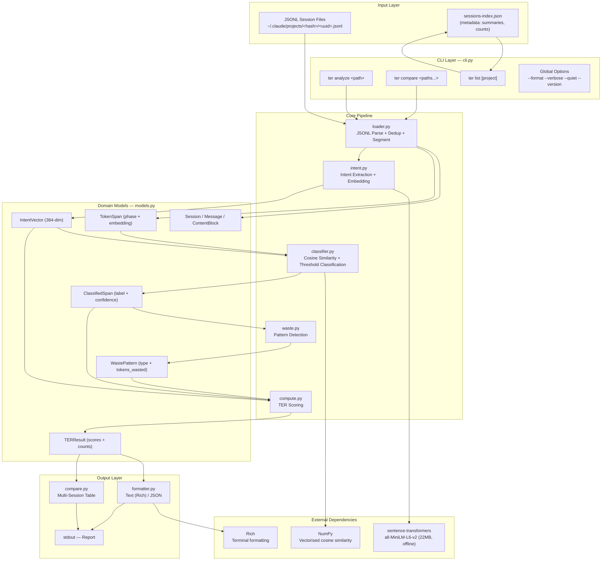
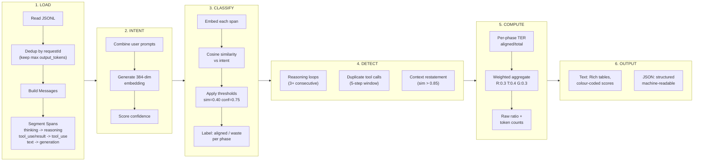
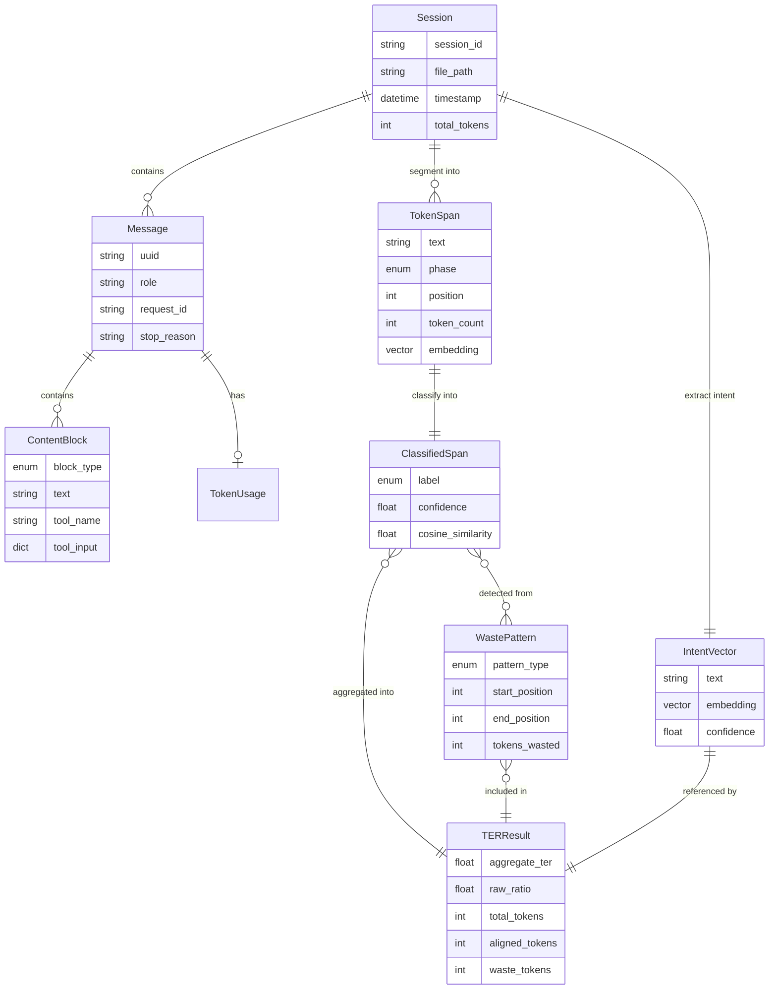
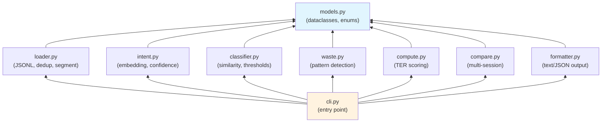

# TER Analyser Architecture & Value Stream Map

**Date**: 2026-04-21 | **Branch**: `docs/architecture-diagram`

---

## 1. System Architecture

---

## 2. Data Pipeline — Sequential Flow

---

## 3. Value Stream Map

The value stream map traces a session analysis from trigger to actionable insight,
identifying value-adding steps, wait/waste, and cycle times.

```mermaid
flowchart LR
    subgraph Trigger["TRIGGER"]
        T["Developer completes<br/>a Claude Code session"]
    end

    subgraph Step1["STEP 1 — Invoke"]
        direction TB
        S1A["User runs<br/>ter analyze &lt;path&gt;"]
        S1M["Cycle: ~0s<br/>Value: enables pipeline"]
    end

    subgraph Step2["STEP 2 — Load & Parse"]
        direction TB
        S2A["Read JSONL<br/>Dedup streaming entries<br/>Build Session object"]
        S2M["Cycle: ~1-3s<br/>Value-add: data ingestion"]
    end

    subgraph Step3["STEP 3 — Intent Extraction"]
        direction TB
        S3A["Combine prompts<br/>Generate embedding<br/>Score confidence"]
        S3M["Cycle: ~2-5s<br/>Value-add: baseline for alignment"]
        S3W["WAIT (first run only):<br/>Model download ~22MB"]
    end

    subgraph Step4["STEP 4 — Span Embedding"]
        direction TB
        S4A["Embed 1,500-2,000<br/>spans for 100k session"]
        S4M["Cycle: ~10-30s<br/>BOTTLENECK:<br/>largest single cost"]
    end

    subgraph Step5["STEP 5 — Classification"]
        direction TB
        S5A["Cosine similarity<br/>+ threshold labelling"]
        S5M["Cycle: <100ms<br/>Value-add: core scoring"]
    end

    subgraph Step6["STEP 6 — Waste Detection"]
        direction TB
        S6A["Pattern scanning<br/>loops / dupes / restatement"]
        S6M["Cycle: <100ms<br/>Value-add: actionable insight"]
    end

    subgraph Step7["STEP 7 — Compute & Report"]
        direction TB
        S7A["Aggregate scores<br/>Format output"]
        S7M["Cycle: <100ms<br/>Value-add: decision support"]
    end

    subgraph Outcome["OUTCOME"]
        O["Developer knows:<br/>- Overall efficiency<br/>- Where waste occurred<br/>- What to change"]
    end

    Trigger --> Step1 --> Step2 --> Step3 --> Step4 --> Step5 --> Step6 --> Step7 --> Outcome
```

### Value Stream Summary

| Step | Activity | Cycle Time | Value Type | Notes |
|------|----------|-----------|------------|-------|
| 1 | CLI invocation | ~0s | Enabling | No waste |
| 2 | JSONL load + dedup | 1-3s | Value-add | Dedup is essential (streaming creates 2-10x entries) |
| 3 | Intent extraction | 2-5s | Value-add | First-run wait for model download (~22MB) |
| 4 | Span embedding | 10-30s | Value-add / **Bottleneck** | Dominates total processing time |
| 5 | Classification | <100ms | Value-add | Fast vectorised NumPy ops |
| 6 | Waste detection | <100ms | Value-add | Converts scores into actionable patterns |
| 7 | Compute + format | <100ms | Value-add | Delivers the decision |
| **Total** | **End-to-end** | **~15-40s** | | **Target: <60s for 100k tokens (SC-001)** |

### Value Stream Observations

- **Lead time**: ~15-40 seconds from invocation to insight for a typical session
- **Bottleneck**: Step 4 (span embedding) consumes 70-80% of total cycle time
- **One-time wait**: First run downloads the embedding model; subsequent runs are offline
- **No queuing waste**: Single-user CLI means no wait-in-queue
- **No handoff waste**: Fully automated pipeline, no manual intervention
- **Information completeness**: Every step produces data consumed downstream; no dead-end branches

---

## 4. Entity Relationship Diagram

---

## 5. Module Dependency Graph

No circular dependencies. All modules depend on `models.py`. Only `cli.py` depends on all others.

---

## 6. Improvement Suggestions

### 6.1 Performance — Span Embedding Bottleneck

**Problem**: Embedding 1,500-2,000 spans for a 100k-token session takes 10-30s and dominates pipeline time.

**Suggestions**:
- **Batch embedding with larger chunks**: Merge adjacent same-phase spans before embedding to reduce the number of vectors needed (e.g., combine 5 consecutive reasoning spans into 1 larger span)
- **Embedding cache**: Cache span embeddings keyed by content hash so re-analysis of the same session is near-instant
- **Lazy embedding**: Only embed spans that pass a cheap pre-filter (e.g., skip very short spans under 10 tokens that won't meaningfully contribute)
- **GPU acceleration**: Optionally detect and use CUDA/MPS for batch embedding when available

### 6.2 Accuracy — Token Counting

**Problem**: The character heuristic (len/4) gives ~80-95% accuracy but can drift significantly for code-heavy spans or non-English text.

**Suggestions**:
- **Use the Anthropic token counting API** as an optional `--exact-tokens` mode for users who have API keys
- **Calibrate the heuristic per phase**: Code tokens (tool results) may have a different chars-per-token ratio than natural language (reasoning/generation). Train per-phase multipliers from sample data
- **Report token count confidence** alongside TER so users know when scores may be imprecise

### 6.3 Intent Extraction Quality

**Problem**: Single embedding for all user prompts may lose nuance in long multi-turn sessions where intent evolves.

**Suggestions**:
- **Sliding intent window**: Create multiple intent vectors (one per conversation "segment") and classify spans against the nearest intent, not a single global one
- **Hierarchical intent**: Extract a high-level intent from the first prompt + sub-intents from follow-ups, then score spans against the most specific applicable intent
- **LLM-assisted intent extraction**: Optionally use Claude to summarise user intent as a structured goal statement before embedding, improving alignment accuracy for ambiguous prompts

### 6.4 Waste Detection — Coverage Gaps

**Problem**: Current detection covers 3 pattern types. Real sessions exhibit additional waste patterns.

**Suggestions**:
- **Permission loop detection**: Identify cycles where the agent attempts an action, gets denied, retries the same approach (common in Claude Code sessions with restricted permissions)
- **Error-retry spirals**: Detect when a tool call fails and the agent retries with minimal/no changes, burning tokens on repeated failures
- **Over-reading detection**: Flag when the agent reads the same file multiple times within a session without the file changing
- **Abandoned approach detection**: Identify when the agent starts down one path (e.g., begins editing a file), abandons it, and restarts with a different approach - the abandoned work is pure waste
- **Verbose thinking detection**: Flag thinking blocks that are disproportionately long relative to the action they produce

### 6.5 User Experience — Feedback Loop

**Problem**: TER reports tell users what happened but don't close the loop on improvement.

**Suggestions**:
- **Prompt improvement hints**: After identifying waste patterns, suggest specific prompt changes that could reduce waste (e.g., "This session had 3 reasoning loops. Try adding 'Do not restate your reasoning' to your prompt or system instructions")
- **Historical trending**: Add a `ter trend` subcommand that shows TER over time for a project, making it easy to see if prompt/workflow changes are helping
- **Session tagging**: Allow users to tag sessions with task type (bug fix, feature, refactor) to compare TER by category
- **CI integration**: Provide a `ter check --threshold 0.6` mode that exits non-zero if TER falls below a threshold, enabling automated quality gates on AI-assisted development

### 6.6 Architecture — Extensibility

**Problem**: The pipeline is linear and tightly sequenced. Adding new analysis passes or output formats requires touching multiple modules.

**Suggestions**:
- **Plugin-based waste detectors**: Define a `WasteDetector` protocol and allow users to register custom detectors (e.g., domain-specific patterns for their workflow)
- **Output plugin system**: Allow custom formatters (CSV, HTML dashboard, Markdown report) without modifying `formatter.py`
- **Pipeline middleware**: Allow injection of pre/post-processing steps (e.g., anonymisation, filtering by phase, time-range slicing) without modifying core modules
- **Configuration file support**: Add `ter.toml` or `.terrc` for per-project defaults (thresholds, weights, output format) so users don't have to pass CLI flags every time

### 6.7 Data Quality — Input Validation

**Problem**: The spec acknowledges edge cases (empty sessions, missing data) but doesn't define a validation layer.

**Suggestions**:
- **Input health report**: Before analysis, produce a quick data quality summary (message count, estimated tokens, content type distribution, any parsing warnings) so users can spot issues before waiting for full analysis
- **JSONL schema validation**: Validate each line against expected structure and report line-level errors rather than failing on the first malformed line
- **Session completeness score**: Report whether the session appears complete (has end_turn stop_reason on final message) or was interrupted

### 6.8 Value Stream — Reducing Lead Time

**Problem**: 15-40s is acceptable but could be much faster for iterative use.

**Suggestions**:
- **Incremental analysis**: Cache intermediate results (parsed session, intent vector, span embeddings) so re-analysis with different thresholds skips expensive steps
- **Quick mode**: Add `--quick` flag that skips embedding entirely and uses cheaper heuristics (keyword matching, token count ratios) for a ~1s approximate TER
- **Watch mode**: Add `ter watch <project>` that monitors for new sessions and auto-analyses them as they complete, providing instant feedback
- **Parallel span embedding**: Use multiprocessing or async batching to parallelise the embedding step across CPU cores

---

## 7. Implementation Status

All 8 improvement areas have been implemented as new modules (5,507 lines total):

| # | Improvement | Module | Lines | Key Capabilities |
|---|-------------|--------|-------|-----------------|
| 1 | Performance — Embedding Bottleneck | `embedding_cache.py` | 610 | Span merging, disk cache, lazy filtering, GPU detection, batch processing |
| 2 | Accuracy — Token Counting | `token_counting.py` | 353 | Per-phase multipliers, least-squares calibration, API exact counting, confidence scoring |
| 3 | Intent Extraction Quality | `intent_extraction.py` | 572 | Sliding window, hierarchical intent, LLM-assisted extraction, strategy protocol |
| 4 | Waste Detection Gaps | `waste_detectors.py` | 791 | Permission loops, error-retry spirals, over-reading, abandoned approaches, verbose thinking |
| 5 | User Experience — Feedback Loop | `feedback.py` | 528 | Prompt hints, historical trending, session tagging, CI threshold checks |
| 6 | Architecture — Extensibility | `plugins.py` | 748 | WasteDetector/OutputFormatter/Middleware protocols, plugin registry, ter.toml config |
| 7 | Data Quality — Input Validation | `validation.py` | 867 | JSONL schema validation, session validation, health reports, completeness scoring |
| 8 | Value Stream — Lead Time | `acceleration.py` | 1038 | Incremental cache, quick mode, watch mode, parallel embedding |

### Enhanced Module Dependency Graph

```mermaid
graph BT
    models["models.py<br/>(dataclasses, enums)"]

    loader["loader.py"]
    intent["intent.py"]
    classifier["classifier.py"]
    waste["waste.py"]
    compute["compute.py"]
    compare["compare.py"]
    formatter["formatter.py"]
    cli["cli.py"]

    emb["embedding_cache.py<br/>NEW: cache + merge + GPU"]
    tok["token_counting.py<br/>NEW: calibrated counting"]
    iex["intent_extraction.py<br/>NEW: sliding + hierarchical"]
    wd["waste_detectors.py<br/>NEW: 5 extra patterns"]
    fb["feedback.py<br/>NEW: hints + trending + CI"]
    pl["plugins.py<br/>NEW: registry + config"]
    val["validation.py<br/>NEW: schema + health"]
    acc["acceleration.py<br/>NEW: cache + quick + watch"]

    loader --> models
    intent --> models
    classifier --> models
    waste --> models
    compute --> models
    compare --> models
    formatter --> models

    emb --> models
    tok --> models
    iex --> models
    wd --> models
    fb --> models
    pl --> models
    val --> models
    acc --> models

    cli --> loader
    cli --> intent
    cli --> classifier
    cli --> waste
    cli --> compute
    cli --> compare
    cli --> formatter
    cli --> pl
    cli --> val
    cli --> acc
    cli --> fb

    intent --> emb
    intent --> iex
    classifier --> emb
    classifier --> tok
    waste --> wd
    loader --> val
    compute --> fb

    style models fill:#e1f5fe
    style cli fill:#fff3e0
    style emb fill:#e8f5e9
    style tok fill:#e8f5e9
    style iex fill:#e8f5e9
    style wd fill:#e8f5e9
    style fb fill:#e8f5e9
    style pl fill:#e8f5e9
    style val fill:#e8f5e9
    style acc fill:#e8f5e9
```

