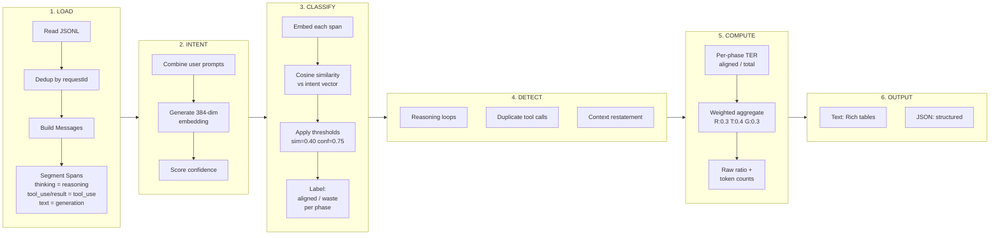
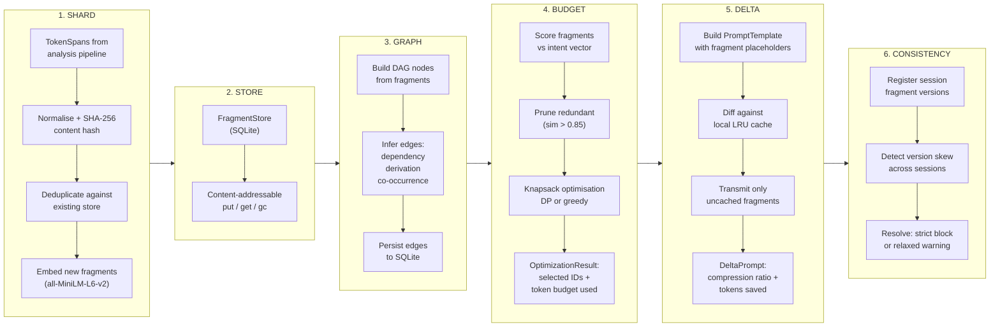
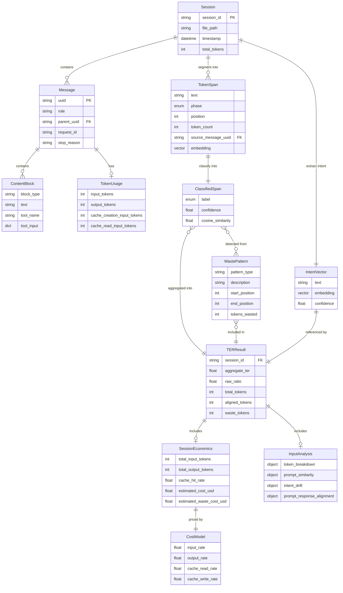
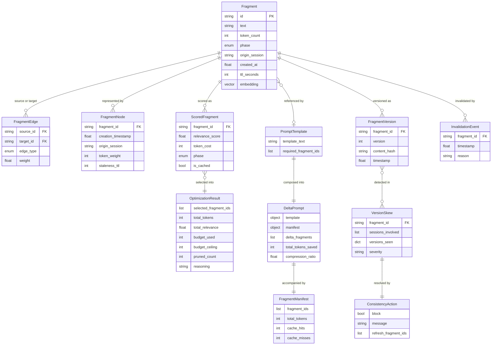

# TER Calculator -- Architecture

**Date**: 2026-05-15 | **Branch**: `feature/context-orchestrator`

---

## 1. System Overview

TER (Token Efficiency Ratio) is a Python 3.11+ CLI tool that measures how
efficiently Claude Code sessions use output tokens. It ingests JSONL session
transcripts, classifies every output token span as **aligned** (contributing to
the user's intent) or **waste** (redundant reasoning, duplicate tool calls,
over-explanation), computes a weighted efficiency score, and surfaces session
economics.

The system now includes a **Context Orchestrator** subsystem that manages
cross-session context fragments. The orchestrator decomposes session context into
content-addressable fragments, organises them in a directed acyclic graph,
applies knapsack-based budget optimisation, composes reference-based delta
prompts, and coordinates version consistency across concurrent sessions.

### External Dependencies

| Dependency | Role |
|---|---|
| `sentence-transformers` | Embedding model (`all-MiniLM-L6-v2`, 384-dim, ~22 MB) |
| `numpy` | Vectorised cosine similarity, knapsack DP table |
| `rich` | Terminal formatting (tables, colour-coded scores) |
| `sqlite3` (stdlib) | Fragment store and edge persistence |

---

## 2. Module Dependency Graph

All source lives under `src/ter_calculator/`. Every module imports `models.py`.
Only `cli.py` fans out to the full set.

```mermaid
graph BT
    models["models.py<br/>(dataclasses, enums)"]

    subgraph core["Core Pipeline"]
        loader["loader.py"]
        intent["intent.py"]
        classifier["classifier.py"]
        waste["waste.py"]
        compute["compute.py"]
        formatter["formatter.py"]
        compare["compare.py"]
        analyze["analyze_pipeline.py"]
        cfgparse["config_parse.py"]
        sessrpt["session_report.py"]
    end

    subgraph bridge["Bridge Modules"]
        rt["real_time.py"]
        ab["adaptive_budget.py"]
        cm["cost_model.py"]
        ot["overthinking.py"]
    end

    subgraph improvement["Improvement Modules"]
        emb["embedding_cache.py"]
        tok["token_counting.py"]
        iex["intent_extraction.py"]
        wd["waste_detectors.py"]
        fb["feedback.py"]
        pl["plugins.py"]
        val["validation.py"]
        acc["acceleration.py"]
    end

    subgraph inputa["Input Analysis"]
        ia["input_analysis.py"]
        ec["economics.py"]
    end

    subgraph orchestrator["Context Orchestrator"]
        fs["fragment_store.py"]
        cg["context_graph.py"]
        bo["budget_optimizer.py"]
        dc["delta_composer.py"]
        con["consistency.py"]
    end

    cli["cli.py<br/>(entry point)"]

    %% Everything depends on models
    loader --> models
    intent --> models
    classifier --> models
    waste --> models
    compute --> models
    formatter --> models
    compare --> models
    analyze --> models
    cfgparse --> models
    sessrpt --> models
    rt --> models
    ab --> models
    cm --> models
    ot --> models
    emb --> models
    tok --> models
    iex --> models
    wd --> models
    fb --> models
    pl --> models
    val --> models
    acc --> models
    ia --> models
    ec --> models
    fs --> models
    cg --> models
    bo --> models
    dc --> models
    con --> models

    %% Core inter-module edges
    intent --> emb
    intent --> iex
    classifier --> emb
    classifier --> tok
    waste --> wd
    waste --> ot
    loader --> val
    compute --> fb
    compute --> cm
    rt --> acc

    %% Context Orchestrator internal chain
    cg --> fs
    bo --> fs
    bo --> cg
    bo --> classifier
    dc --> fs
    con --> fs
    con --> cg

    %% CLI fans out
    cli --> loader
    cli --> intent
    cli --> classifier
    cli --> waste
    cli --> compute
    cli --> compare
    cli --> formatter
    cli --> pl
    cli --> val
    cli --> acc
    cli --> fb
    cli --> rt
    cli --> ab
    cli --> cm

    style models fill:#e1f5fe
    style cli fill:#fff3e0
    style fs fill:#f3e5f5
    style cg fill:#f3e5f5
    style bo fill:#f3e5f5
    style dc fill:#f3e5f5
    style con fill:#f3e5f5
    style emb fill:#e8f5e9
    style tok fill:#e8f5e9
    style iex fill:#e8f5e9
    style wd fill:#e8f5e9
    style fb fill:#e8f5e9
    style pl fill:#e8f5e9
    style val fill:#e8f5e9
    style acc fill:#e8f5e9
    style rt fill:#fce4ec
    style ot fill:#fce4ec
    style ab fill:#fce4ec
    style cm fill:#fce4ec
```



### Context Orchestrator Internal Dependencies

The five orchestrator modules form their own dependency sub-graph:

```
fragment_store.py  (no orchestrator deps -- foundation)
    |
    +---> context_graph.py       (imports fragment_store for DB path sharing)
    |         |
    |         +---> budget_optimizer.py  (imports fragment_store + context_graph + classifier)
    |
    +---> delta_composer.py      (imports fragment_store)
    |
    +---> consistency.py         (imports fragment_store + context_graph)
```

No circular dependencies exist. `fragment_store` is the leaf; all other
orchestrator modules depend on it.

---

## 3. Data Flow Diagrams

### 3a. Analysis Pipeline

The primary pipeline transforms a JSONL session file into a TER report.



### 3b. Context Orchestrator Pipeline

The orchestrator pipeline manages cross-session context reuse.



---

## 4. Entity Relationship Diagram

### 4a. Core Analysis Models



### 4b. Context Orchestrator Models



---

## 5. Storage Architecture

TER uses three storage layers with distinct lifecycles.

```
Storage Layer          Format       Location                             Lifecycle
---------------------  -----------  -----------------------------------  --------------------
Session transcripts    JSONL        ~/.claude/projects/<hash>/<uuid>.jsonl  Read-only input
Fragment store + edges SQLite (WAL) ~/.cache/ter/fragments.db            Append + GC (TTL)
Analysis history       JSON          ~/.cache/ter/history.json            Append
Budget history         JSON          ~/.cache/ter/budget_history.json     Append
Embedding cache        Binary        ~/.cache/ter/embeddings/             Content-addressed
```

### SQLite Schema (`fragments.db`)

The fragment store and context graph share a single SQLite database with WAL
journaling for concurrent read access.

**Table: `fragments`**

| Column | Type | Notes |
|---|---|---|
| `id` | TEXT PK | SHA-256 of normalised text |
| `text` | TEXT | NFC-normalised, whitespace-collapsed |
| `embedding` | BLOB | 384 x float32 = 1,536 bytes |
| `token_count` | INTEGER | Heuristic or calibrated count |
| `phase` | TEXT | reasoning / tool_use / generation |
| `origin_session` | TEXT | Session ID that created this fragment |
| `created_at` | REAL | Unix epoch timestamp |
| `ttl_seconds` | INTEGER | Default 3600 (1 hour) |

**Table: `edges`**

| Column | Type | Notes |
|---|---|---|
| `source_id` | TEXT | FK to fragments.id |
| `target_id` | TEXT | FK to fragments.id |
| `edge_type` | TEXT | dependency / derivation / co_occurrence |
| `weight` | REAL | Default 1.0 |
| PK | | (source_id, target_id, edge_type) |

**Table: `schema_version`**

Single-row table tracking migration version (currently version 1).

### Garbage Collection

- `FragmentStore.gc(max_age_hours)` deletes rows where
  `created_at + ttl_seconds < cutoff`.
- `ContextGraph.prune_stale(max_age_hours)` removes orphaned nodes and their
  edges from both the in-memory adjacency list and SQLite.

---

## 6. Embedding and Similarity

### Model

- **Model**: `all-MiniLM-L6-v2` via `sentence-transformers`
- **Dimensionality**: 384
- **Download size**: ~22 MB (cached locally after first run)
- **Inference**: CPU by default; GPU auto-detected when available

### Similarity Function

Cosine similarity between two vectors **a** and **b**:

```
cos(a, b) = dot(a, b) / (norm(a) * norm(b))
```

Implemented in `classifier.py` using NumPy vectorised operations.

### Content-Addressable Hashing

Fragment identity is derived from a SHA-256 hash of the text after
normalisation:

1. Apply Unicode NFC normalisation.
2. Collapse all whitespace runs to single spaces.
3. Compute `hashlib.sha256(normalized.encode("utf-8")).hexdigest()`.

Two fragments with identical normalised text always produce the same ID,
enabling cross-session deduplication without comparing embeddings.

### Thresholds

| Parameter | Default | Used In |
|---|---|---|
| Alignment similarity | 0.40 | `classifier.py` -- span is aligned if cosine sim >= threshold |
| Alignment confidence | 0.75 | `classifier.py` -- minimum classifier confidence |
| Redundancy pruning | 0.85 | `budget_optimizer.py` -- prune near-duplicate fragments |
| Relevance floor | 0.10 | `budget_optimizer.py` -- discard low-relevance fragments before knapsack |

### Budget Optimisation Strategy

The `budget_optimizer.py` module uses a two-tier approach:

1. **Dynamic programming knapsack** when fragment count is at most 500 (exact
   solution, quantised to 100-token granularity).
2. **Greedy fractional knapsack** when fragment count exceeds 500 (approximation,
   ranked by relevance-per-token).

Phase weights (reasoning 0.3, tool_use 0.4, generation 0.3) are applied as
multipliers on the cosine similarity score before optimisation.
