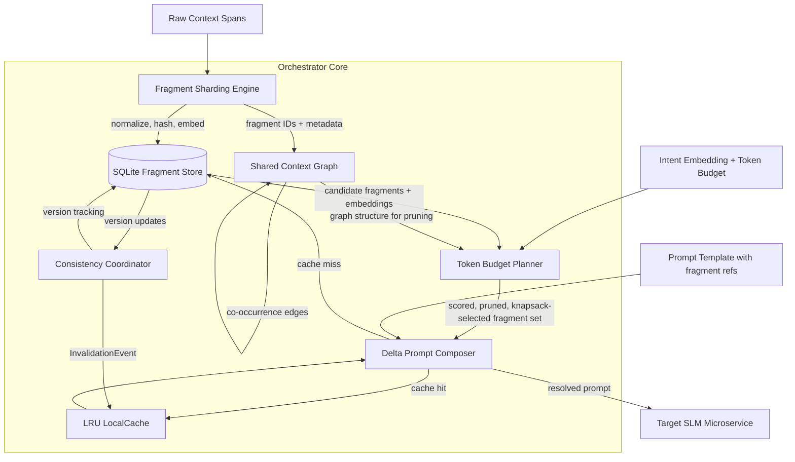

# Token Aware Microprompt Orchestrator

Patent implementation reference for the context orchestration layer in TER.

---

## 1. Problem Statement

Small Language Model (SLM) microservices deployed in cloud-native architectures share significant amounts of conversational and tool-generated context. Under current approaches, each microservice independently serializes the full shared context into every prompt call it issues. This creates four compounding problems:

1. **Token waste.** The same context fragments are encoded repeatedly across services. If N services each consume a shared context of T tokens, the aggregate cost is O(N * T) per invocation cycle rather than the O(T) that a shared representation would require.

2. **Latency amplification.** Serializing, transmitting, and deserializing redundant context adds wall-clock time to every call. For latency-sensitive pipelines with sequential service dependencies, these costs accumulate along the critical path.

3. **Cost scaling.** Token-based pricing models mean that redundant serialization translates directly to linear cost growth with the number of consuming services. At scale, context duplication dominates the inference budget.

4. **Consistency divergence.** When each service maintains its own serialized copy of shared context, updates propagate asynchronously or not at all. Services operate on stale or conflicting state representations, producing incoherent outputs that are difficult to diagnose.

The root cause is the absence of a shared, content-addressable context layer that allows services to reference context fragments by identity rather than by value, and to negotiate token budgets against a single authoritative representation.

---

## 2. Solution Architecture

The Token Aware Microprompt Orchestrator introduces five coordinating components that replace per-service context serialization with a shared, deduplicated, budget-aware context pipeline.

### 2.1 Fragment Sharding Engine (`fragment_store.py`)

Decomposes raw context spans (user messages, tool results, reasoning traces, system instructions) into content-addressable fragments.

**Normalization pipeline:**

1. Apply NFC unicode normalization to the input text.
2. Collapse contiguous whitespace runs to single spaces.
3. Strip leading and trailing whitespace.
4. Compute a SHA-256 hash of the normalized byte representation (UTF-8 encoded).

The resulting hash serves as the fragment ID. The process is strictly deterministic: identical input text always produces the same fragment ID regardless of when or where the sharding occurs.

**Storage backend:**

- SQLite database operating in WAL (Write-Ahead Logging) mode for concurrent read access.
- Each fragment record stores: `fragment_id` (TEXT PRIMARY KEY), `content` (TEXT), `token_count` (INTEGER), `embedding` (BLOB, serialized float32 vector), `created_at` (REAL, Unix timestamp), `ttl` (INTEGER, seconds), `version` (INTEGER, monotonically increasing).
- Fragment embeddings are computed at shard time using the configured sentence-transformer model.

**Key properties:**

- Content-addressable: duplicate content is stored exactly once.
- Immutable content: a fragment's text never changes after creation. Updates to semantically equivalent content produce new versions under the same ID with an incremented version number.
- TTL-based expiry: fragments carry a time-to-live value and are eligible for eviction after expiry.

### 2.2 Shared Context Graph (`context_graph.py`)

Maintains a directed acyclic graph (DAG) that captures structural relationships between fragments. The graph enables the budget planner to make informed inclusion/exclusion decisions based on fragment dependencies.

**Edge types:**

| Edge Type | Semantics | Example |
|---|---|---|
| DEPENDENCY | Target fragment is required to interpret source fragment | A `tool_result` fragment depends on the `tool_use` fragment that invoked it |
| DERIVATION | Source fragment was generated from target fragment | A generation fragment derives from the reasoning fragment that produced it |
| CO_OCCURRENCE | Fragments appeared together in the same message | Two tool results returned in a single assistant turn |

**Implementation:**

- In-memory adjacency list representation for fast traversal.
- SQLite persistence for durability across process restarts.
- Adjacency list is rebuilt from the database on startup.

**Graph operations:**

- `add_edge(source, target, edge_type)`: Insert a directed edge. Rejects edges that would create a cycle (verified by DFS from target to source before insertion).
- `get_subgraph(fragment_ids)`: BFS expansion from seed fragments, returning all transitively reachable fragments within a configurable depth limit.
- `topological_sort()`: Returns a linear ordering of fragments respecting dependency edges. Used by the composer to order fragment inclusion.
- `detect_cycles()`: Full-graph cycle detection. Should always return empty under correct operation; non-empty results indicate a bug.
- `prune_stale(max_age)`: Removes fragments and their edges when the fragment's creation time plus TTL has elapsed.

### 2.3 Token Budget Planner (`budget_optimizer.py`)

Given a token budget and an intent embedding, selects the subset of available fragments that maximizes relevance while respecting the budget constraint.

**Scoring function:**

```
score(fragment, intent) = cosine_similarity(fragment.embedding, intent_embedding) * phase_weight
```

- `cosine_similarity`: Standard cosine similarity between the fragment's embedding vector and the intent embedding vector.
- `phase_weight`: A multiplier from the phase configuration that adjusts scoring based on the current pipeline phase (e.g., planning phase upweights system instructions, execution phase upweights tool results).

**Optimization strategy:**

- **Exact dynamic programming** when the candidate set contains 500 or fewer fragments. Token costs are quantized to the nearest 100 tokens to reduce the DP table dimensions and keep memory usage bounded. The DP formulation is the standard 0/1 knapsack: maximize total score subject to total quantized token cost not exceeding the quantized budget.
- **Greedy approximation** when the candidate set exceeds 500 fragments. Fragments are sorted by score-per-token in descending order and greedily included until the budget is exhausted.

**Redundancy pruning:**

Before optimization, the planner identifies parent-child fragment pairs (connected by DEPENDENCY or DERIVATION edges in the context graph) whose embeddings have cosine similarity exceeding the `redundancy_threshold` (default: 0.85). In such cases, the child fragment is removed from the candidate set because the parent already captures its semantic content. This reduces both the candidate set size and the risk of allocating budget to near-duplicate information.

**Output:**

An ordered list of `(fragment_id, allocated_tokens)` pairs representing the selected fragments and their token costs.

### 2.4 Delta Prompt Composer (`delta_composer.py`)

Assembles final prompts from templates containing fragment references, using a local cache to minimize redundant fragment lookups.

**Template format:**

Prompt templates contain `{{fragment_id}}` placeholders. The composer resolves these placeholders to fragment content during prompt assembly.

**LocalCache (LRU):**

- Maximum capacity: 1000 fragments (configurable via `max_size`).
- Eviction policy: Least Recently Used.
- Cache entries store the fragment content keyed by fragment ID.

**Core operations:**

- `compose_delta(template, available_fragments)`: Scans the template for `{{fragment_id}}` references. Partitions references into cache hits (fragment content available in LocalCache) and cache misses (must be fetched from the fragment store). Returns a delta specification listing which fragments need to be fetched.
- `resolve_prompt(template, fragments)`: Inlines fragment content into the template, replacing each `{{fragment_id}}` placeholder with the corresponding fragment text. Fragments are inserted in topological order (obtained from the context graph) to ensure that dependency fragments appear before the fragments that reference them.

**Cache invalidation:**

The composer subscribes to `InvalidationEvent` messages published by the Consistency Coordinator. When an event arrives for a cached fragment, the corresponding cache entry is evicted immediately. This is event-driven, not polling-based: the cache never serves a fragment that has been explicitly invalidated.

### 2.5 Consistency Coordinator (`consistency.py`)

Tracks fragment versions across concurrent sessions and detects version skew that could lead to inconsistent prompt composition.

**Version tracking:**

Each session registers the fragment versions it is currently using. The coordinator maintains a map of `fragment_id -> {session_id: version}` entries.

**Skew detection:**

When a session attempts to use a fragment, the coordinator compares the session's version against the latest known version. If they differ, a version skew is detected.

**Severity classification:**

| Severity | Condition | Description |
|---|---|---|
| LOW | 2 sessions hold divergent versions | Minor skew, likely transient |
| MEDIUM | 3 or more sessions hold divergent versions | Widespread inconsistency |
| HIGH | Version gap between any two sessions exceeds 2 | Significant drift indicating missed updates |

**Enforcement modes:**

- `STRICT`: When skew is detected, the coordinator blocks the operation and returns an error. The consuming session must update to the latest fragment version before proceeding.
- `RELAXED`: When skew is detected, the coordinator logs a warning but allows the operation to proceed with the session's current (potentially stale) fragment version.

**Invalidation events:**

When a fragment version is updated, the coordinator publishes an `InvalidationEvent` containing the fragment ID, the old version, and the new version. Subscribers (primarily the Delta Prompt Composer's LocalCache) use these events to evict stale entries.

---

## 3. Fragment Lifecycle

A fragment progresses through six stages from creation to invalidation.

### 3.1 Creation (Shard)

Raw context spans arrive from session messages, tool invocations, or reasoning traces. The Fragment Sharding Engine processes each span:

1. Extract the text content from the span.
2. Apply NFC unicode normalization.
3. Collapse whitespace.
4. Compute SHA-256 hash to produce the fragment ID.
5. Compute the embedding vector using the sentence-transformer model.
6. Record the token count.

### 3.2 Storage

The fragment record is inserted into SQLite. If a fragment with the same ID already exists, the version is incremented and the TTL is refreshed. WAL mode ensures that concurrent readers are not blocked during writes.

### 3.3 Graph Construction

The context graph is updated based on the session structure that produced the fragment:

- Tool result fragments receive DEPENDENCY edges pointing to their originating tool use fragments.
- Generated text fragments receive DERIVATION edges pointing to the reasoning fragments they were produced from.
- Fragments originating from the same message receive CO_OCCURRENCE edges between each pair.

### 3.4 Optimization

When a prompt needs to be composed, the Token Budget Planner:

1. Retrieves all candidate fragments from the store (filtering by TTL expiry).
2. Scores each candidate against the current intent embedding, applying phase weights.
3. Prunes redundant parent-child pairs (cosine similarity > 0.85).
4. Runs knapsack optimization (exact DP for <=500 candidates, greedy otherwise).
5. Returns the selected fragment set with allocated token budgets.

### 3.5 Composition

The Delta Prompt Composer receives a template and the selected fragment set:

1. `compose_delta()` identifies cache hits and misses.
2. Missed fragments are fetched from the fragment store and inserted into the LocalCache.
3. `resolve_prompt()` inlines all fragment content into the template in topological order.
4. The fully resolved prompt is returned for submission to the target SLM.

### 3.6 Invalidation

When a fragment's source content changes:

1. The Fragment Sharding Engine creates a new version of the fragment (same ID, incremented version).
2. The Consistency Coordinator detects the version change and publishes an `InvalidationEvent`.
3. The Delta Prompt Composer's LocalCache receives the event and evicts the stale entry.
4. Subsequent `compose_delta()` calls for that fragment will trigger a cache miss, fetching the updated content.

---

## 4. Data Flow Diagram

The following Mermaid diagram shows the complete orchestrator pipeline from raw context input through to resolved prompt output.



**Pipeline summary:**

1. Raw context spans enter the Fragment Sharding Engine.
2. The engine normalizes, hashes, embeds, and stores each fragment in SQLite.
3. The Shared Context Graph records structural relationships between fragments.
4. When a prompt is needed, the Token Budget Planner scores fragments against the intent, prunes redundancies using graph structure, and selects the optimal subset via knapsack.
5. The Delta Prompt Composer resolves a template by inlining selected fragments, using its LRU cache to avoid redundant store lookups.
6. The Consistency Coordinator monitors fragment versions across sessions and publishes invalidation events to keep caches coherent.

---

## 5. CLI Commands

All context orchestrator commands are accessed via the `ter context` subcommand group.

### `ter context store`

Manage the fragment store.

```bash
# Shard a context file into fragments
$ ter context store --input session.jsonl
Sharded 47 spans into 31 unique fragments (16 deduplicated)
Fragment store: 31 fragments, 12,847 tokens total

# List stored fragments
$ ter context store --list
FRAGMENT_ID                                                        TOKENS  VERSION  AGE
a1b2c3d4e5f6789012345678901234567890123456789012345678901234abcd     340     1        2m
b2c3d4e5f67890123456789012345678901234567890123456789012345bcde     128     1        2m
...
31 fragments, 12,847 tokens total

# Show a specific fragment
$ ter context store --show a1b2c3d4
Fragment: a1b2c3d4e5f6789012345678901234567890123456789012345678901234abcd
Version:  1
Tokens:   340
Created:  2026-05-15T10:23:41Z
TTL:      3600s (expires in 3542s)
Content:
  The user requested analysis of the authentication module...

# Purge expired fragments
$ ter context store --purge
Purged 8 expired fragments (2,104 tokens freed)
```

### `ter context graph`

Inspect and manage the context graph.

```bash
# Build graph from current fragment store
$ ter context graph --build
Built context graph: 31 nodes, 44 edges
  DEPENDENCY:    18 edges
  DERIVATION:    12 edges
  CO_OCCURRENCE: 14 edges

# Show edges for a fragment
$ ter context graph --edges a1b2c3d4
Fragment a1b2c3d4:
  DEPENDENCY    -> f7e6d5c4  (tool_result depends on tool_use)
  DERIVATION    <- c3d4e5f6  (generation derived from reasoning)
  CO_OCCURRENCE <> b2c3d4e5  (same message)

# Extract a subgraph
$ ter context graph --subgraph a1b2c3d4 --depth 2
Subgraph from a1b2c3d4 (depth 2): 7 nodes, 9 edges

# Run cycle detection
$ ter context graph --check-cycles
No cycles detected.

# Prune stale nodes
$ ter context graph --prune --max-age 7200
Pruned 3 stale nodes and 5 associated edges
```

### `ter context optimize`

Run the token budget planner.

```bash
# Optimize fragment selection for a given budget
$ ter context optimize --budget 4096 --intent "Analyze authentication flow"
Intent embedding computed (384 dimensions)
Candidate fragments: 31
Redundancy pruning: removed 4 fragments (cosine sim > 0.85)
Remaining candidates: 27
Strategy: exact DP (27 <= 500)
Token quantization: nearest 100

Selected 11 fragments (3,940 tokens, budget utilization 96.2%):
  FRAGMENT_ID   TOKENS  SCORE   PHASE_WEIGHT
  a1b2c3d4       340    0.91    1.0
  f7e6d5c4       280    0.87    1.0
  c3d4e5f6       520    0.82    0.8
  ...

Rejected 16 fragments (8,907 tokens):
  Top 3 by score that did not fit:
  d4e5f6a7       1200   0.79    1.0  (budget exceeded)
  ...

# Dry-run with greedy strategy
$ ter context optimize --budget 4096 --intent "Analyze authentication flow" --strategy greedy
Strategy: greedy (forced)
Selected 10 fragments (3,880 tokens, budget utilization 94.7%)
```

### `ter context delta`

Compose prompts using fragment references.

```bash
# Compose a delta from a template
$ ter context delta --template prompt.tpl --fragments selected.json
Template references: 11 fragment IDs
Cache hits:  7 (63.6%)
Cache misses: 4 (36.4%)
Fetched 4 fragments from store
Resolved prompt: 3,940 tokens

# Output the resolved prompt
$ ter context delta --template prompt.tpl --fragments selected.json --output resolved.txt
Wrote resolved prompt to resolved.txt (3,940 tokens)

# Show cache state
$ ter context delta --cache-stats
LRU LocalCache:
  Capacity: 1000
  Entries:  23
  Hit rate: 71.4% (lifetime)
  Memory:   ~48 KB
```

### `ter context check`

Run consistency checks across sessions.

```bash
# Check for version skew
$ ter context check
Sessions tracked: 3
Fragment versions checked: 31

Version skew detected:
  FRAGMENT_ID   SESSION_A  SESSION_B  SESSION_C  SEVERITY
  a1b2c3d4      v3         v3         v1         HIGH (gap > 2)
  b2c3d4e5      v2         v1         v2         LOW  (2 sessions diverge)

2 skew issues found (1 HIGH, 1 LOW)

# Check with strict enforcement
$ ter context check --mode strict
ERROR: Version skew detected on fragment a1b2c3d4 (severity HIGH)
  Session sess_003 holds v1, latest is v3
  Action: blocked. Update session sess_003 before proceeding.

# Check with relaxed enforcement
$ ter context check --mode relaxed
WARNING: Version skew detected on fragment a1b2c3d4 (severity HIGH)
  Session sess_003 holds v1, latest is v3
  Action: proceeding with stale version (relaxed mode)
```

---

## 6. Configuration and Tuning

All orchestrator parameters can be set via the TER configuration file or overridden with CLI flags.

### 6.1 Relevance Threshold

| Parameter | `relevance_threshold` |
|---|---|
| Default | `0.1` |
| Range | `0.0` to `1.0` |
| Description | Minimum cosine similarity score for a fragment to be considered a candidate during budget optimization. Fragments scoring below this threshold are excluded before the knapsack step. |

**Tuning guidance:** Lower values (0.05) include more marginally relevant context at the cost of budget. Higher values (0.3) produce tighter, more focused prompts but risk excluding useful context. The default of 0.1 filters noise while retaining broadly relevant fragments.

### 6.2 Redundancy Threshold

| Parameter | `redundancy_threshold` |
|---|---|
| Default | `0.85` |
| Range | `0.0` to `1.0` |
| Description | Maximum cosine similarity between a parent and child fragment (connected by DEPENDENCY or DERIVATION edges) before the child is pruned as redundant. |

**Tuning guidance:** Lower values (0.7) aggressively deduplicate, which saves tokens but may discard fragments that add meaningful detail beyond their parent. Higher values (0.95) preserve more fragments at the cost of potential redundancy. The default of 0.85 balances deduplication against information loss.

### 6.3 LRU Cache Max Size

| Parameter | `max_size` |
|---|---|
| Default | `1000` |
| Range | `1` to `100000` |
| Description | Maximum number of fragment entries held in the Delta Prompt Composer's LRU LocalCache. |

**Tuning guidance:** Size this to the working set of fragments accessed during a typical session. For single-session workloads, 500 is usually sufficient. For multi-session workloads with shared fragments, 2000-5000 reduces cache misses. Memory cost is approximately 2 KB per entry (fragment content + metadata).

### 6.4 Fragment TTL

| Parameter | `ttl` |
|---|---|
| Default | `3600` (seconds, i.e., 1 hour) |
| Range | `60` to `86400` |
| Description | Time-to-live for stored fragments. Expired fragments are eligible for eviction during purge operations and are excluded from optimization candidate sets. |

**Tuning guidance:** Short TTLs (300-600s) suit ephemeral conversational context where stale fragments quickly become irrelevant. Long TTLs (7200-86400s) suit reference material and system instructions that remain valid across sessions. The default of 3600s works for typical interactive sessions.

### 6.5 Consistency Mode

| Parameter | `consistency_mode` |
|---|---|
| Default | `strict` |
| Values | `strict`, `relaxed` |
| Description | Determines behavior when fragment version skew is detected across sessions. |

**Tuning guidance:** Use `strict` in production environments where prompt consistency is critical (e.g., multi-service pipelines where one service's output feeds another). Use `relaxed` in development or exploratory settings where version skew is tolerable and blocking would impede iteration speed.

### 6.6 Configuration Example

```yaml
context_orchestrator:
  relevance_threshold: 0.1
  redundancy_threshold: 0.85
  cache:
    max_size: 1000
  fragment:
    ttl: 3600
  consistency:
    mode: strict
  budget:
    quantization_step: 100
    dp_threshold: 500
  graph:
    max_subgraph_depth: 5
    prune_interval: 600
```

### 6.7 Additional Parameters

| Parameter | Default | Description |
|---|---|---|
| `quantization_step` | `100` | Token cost rounding granularity for DP table construction. Larger values reduce memory at the cost of allocation precision. |
| `dp_threshold` | `500` | Maximum candidate set size for exact DP. Sets larger than this fall back to greedy. |
| `max_subgraph_depth` | `5` | Maximum BFS depth when extracting subgraphs from the context graph. |
| `prune_interval` | `600` | Seconds between automatic stale fragment pruning cycles. |
