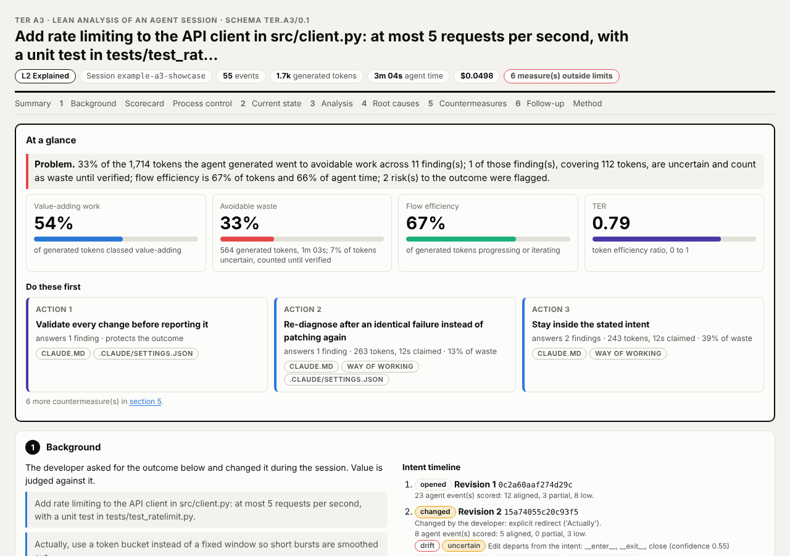
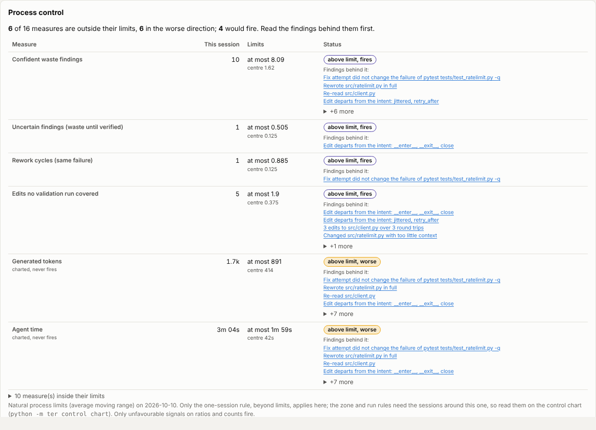

# Example A3: rate limiting an API client

This is the A3 that `ter a3` writes for one synthetic Claude Code session,
placed against control limits computed from the golden corpus. The session
is built to show, on one page, the patterns TER 4 learned to look for on real
sessions. It holds no real user data.

**Open the page:** [a3.html](a3.html) (GitHub shows the source; open the file
in a browser after cloning, or through
[htmlpreview](https://htmlpreview.github.io/?https://github.com/lgriffin/TER/blob/main/docs/examples/a3/a3.html)).
The same A3 as data is [a3.json](a3.json).



## The session

The developer asks for rate limiting in `src/client.py`, at most 5 requests
per second, with a unit test. The agent searches and reads twice, reads two
files it never uses, writes a fixed-window limiter and then rewrites the whole
file to add a docstring, and wires it in with three one-line edits. Its test
fails; the first fix guesses wrong and the same failure comes back, the second
fixes it. The developer then changes the ask to a token bucket. The agent
builds it, adds two helpers it announces as extra ("while I'm at it"), turns
the client into a context manager nobody asked for, and reports without
running the tests again.

| File | What it is |
|---|---|
| [session.jsonl](session.jsonl) | The transcript, in Claude Code's JSONL format |
| [limits.json](limits.json) | XmR control limits of the golden corpus (`tests/golden/snapshots/control/corpus.limits.json`) |
| [a3.html](a3.html), [a3.json](a3.json) | The A3 page and its view-model |
| [a3-summary.png](a3-summary.png), [a3-process-control.png](a3-process-control.png) | The screenshots on this page |

## What to look for

- **Problem and actions first.** The summary leads with one problem statement
  (33% of 1,714 generated tokens went to avoidable work, flow efficiency 67%)
  and the three countermeasures to apply first, each tagged with where it
  goes: `CLAUDE.md`, `.claude/settings.json` or a way of working.
- **Confident and uncertain findings, side by side.** 13 findings from 9
  detectors. Most are confident; two are below 0.70 and labelled uncertain:
  the unrequested context-manager methods (`intent_drift`, 0.55) and too
  little context before a change (`insufficient_context`, 0.55). Uncertain
  waste counts in the totals until someone verifies it, and never triggers an
  intervention ([ADR 0006](../../decisions/0006-uncertain-waste-counts-until-verified.md)).
- **Drift graded by evidence.** The helpers the agent itself called extra are
  confident drift (0.85); the context manager, which it never announced, is
  only uncertain, because new code always defines new names.
- **Rework versus iteration.** Only the fix attempt that left the failure
  unchanged is rework. The attempt that turned it green is iteration, and is
  not counted ([tests/golden/sessions/iteration_converges.jsonl](../../../tests/golden/sessions/iteration_converges.jsonl)
  is the pure case).
- **Whole-file rewrites.** `regeneration` flags the rewrite of a file the
  agent had just written: on real sessions, rewrites like this were one of
  the strongest signals.
- **Risks apart from waste.** Five edits reported without a validation run and
  a change made on thin context are risks to the outcome; they claim no token
  cost.
- **Value stream and Pareto.** Section 2 shows where in the stream
  (explore, plan, implement, validate) the waste happened; section 3 ranks it
  in a Pareto, uncertain waste included.
- **Process control.** Six of sixteen measures are outside the golden
  corpus's limits. Four fire: confident findings, uncertain findings, rework
  cycles and edits no validation covered, each linked to the findings behind
  it. Generated tokens and agent time are outside too but never fire: on real
  sessions the worst session was large rather than wasteful, so size is
  charted, not alarmed. The other ten measures sit inside their limits.



## Rebuild it

```bash
ter a3 docs/examples/a3/session.jsonl --limits docs/examples/a3/limits.json --html a3.html --json a3.json
```

`ter a3` uses offline, deterministic adapters by default, so this writes the
committed page byte for byte. `python scripts/example_a3.py` rewrites the
files here (`--screenshots` also retakes the PNGs, with Playwright).
[tests/docs/test_example_a3.py](../../../tests/docs/test_example_a3.py) fails when a
detector, scoring or renderer change moves the page, and when the example
loses its variety (no uncertain finding, no firing signal); regenerate with
`TER_UPDATE_GOLDEN=1 pytest tests/docs/test_example_a3.py` and commit the diff.

To read any section in depth, see the [A3 guide](../../guides/a3-report.md)
and [control charts](../../ter4/control-charts.md).
