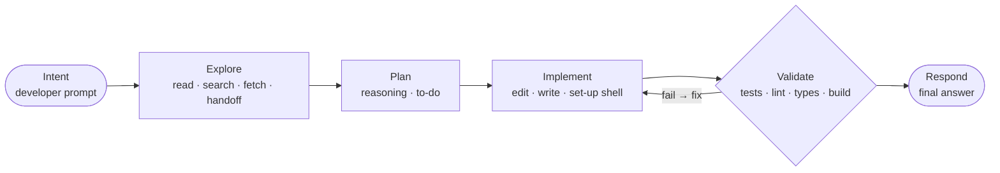

# Lean for agentic software engineering

TER started as a token efficiency ratio: how many of the tokens an agent
generated were aligned with what the developer asked. That number says *how
much* was off-target, not *what kind* of waste it was, *why* it happened or
*what to change*. From maturity level L2, TER answers those questions with
Lean: the same thinking that manufacturing and software teams use to find
waste in a process, applied to a coding agent's session.

This guide is the practical introduction. The formal model, with every rule,
is [docs/ter4/l2-explained.md](../ter4/l2-explained.md) and its rationale is
[ADR 0004](../decisions/0004-lean-waste-model.md).

## The Lean question, asked of an agent

Lean asks of every activity: does it add value the customer asked for, is it
necessary but not itself valuable, or could it be avoided? For TER the
customer is the developer and value is **the software outcome the developer
requested**. Tokens are a cost, not the goal: fewer tokens are not
automatically better, and more reasoning is not automatically waste.

Try it on the synthetic sessions in the golden corpus:

```bash
ter explain tests/golden/sessions/lean_mix.jsonl
ter explain tests/golden/sessions/iteration_converges.jsonl
ter explain tests/golden/sessions/lean_mix.jsonl --json
```

```text
TER explain · session golden-lean-mix
  flow efficiency  61% of generated tokens, 61% of agent time
  activity         value_adding 344 · necessary_non_value_adding 83 · avoidable 270 · uncertain 0
  findings         5 waste (0 uncertain, counted until verified), 1 risk(s)
  - [0.80] overproduction: Rewrote src/retry.py in full · 138 tok · evidence 23e8557e97c5cf7b, bbef9c623af73c14
  - [0.80] over_processing: 5 planning steps without acting · 107 tok · evidence 11dd3be920e41229, …
  - [0.85] over_processing: Repeated validation run · 53 tok · evidence 3a6966ef0e054a01, …
  - [0.90] over_processing: Repeated Bash call · 26 tok · evidence dc771e57dc3ec0aa, …
  - [0.70] over_processing: 3 edits to src/net.py over 3 round trips · 22 tok · evidence 201a5b895ab673e9, …
  - [0.85] defects: Responded after a failing check · risk · evidence c546d6039402b9c4, …
```

The session that fails a test, fixes it, hits a *different* failure, fixes
that and passes (`iteration_converges`) has 100% flow efficiency and no
findings: that is productive iteration, not rework.

## The agentic value stream

Every event in a session is placed on one of six stages, from the
developer's intent to the agent's final response.



Stages come from tool *kinds* in the `ter.event` contract (`fs.read`,
`fs.edit`, `exec.shell`, `agent.handoff`, …), never from Claude Code tool
names, so the model carries over to other harnesses. A shell command is
placed by what it does: `pytest`, `ruff` or `mypy` validate, `ls` or `git
status` explore, `pip install` or `git commit` implement. Developer prompts
are the intent stage and are never scored.

## Activity classes

| Class | Meaning | Default for |
|---|---|---|
| Value-adding | Directly produces the requested outcome | edits and writes; the final response to a prompt |
| Necessary, non-value-adding | Needed to produce value safely, not value itself | exploring, planning, validating, narration |
| Avoidable | Could have been skipped with no loss | the share of an event claimed by a confident waste finding |
| Uncertain (bucket) | A finding claims it, but below confidence 0.70 | shown, never counted as avoidable |

Every event carries a `basis`: the stage rule or the finding id that gave it
its class, so any number can be traced back to the events behind it.

## The waste taxonomy

TER maps eight classic Lean wastes onto agent behaviour
(`ter.domain.lean.LeanWaste`). Each waste also moves tokens and time into a
flow state, used by the flow efficiency measure below.

| Lean waste | What it looks like for a coding agent | Flow state | L2 detectors |
|---|---|---|---|
| Rework | Changing work again because an attempt did not move a failing check | reworking | `rework_cycle` |
| Motion | Moving through the repository again: re-reading files, re-running searches | repeating | `repeated_exploration` |
| Over-processing | More handling than the outcome needs: repeated calls, reasoning or planning | repeating | `repeated_tool_call`, `repeated_reasoning`, `excessive_planning`, `fragmented_edits` |
| Waiting | The session blocked on another model, agent or external call | waiting | (through `unnecessary_handoff`) |
| Inventory | Context acquired and carried but never used by a later action | inventory | `unused_context` |
| Defects | Work likely to hide defects: unvalidated or uninformed changes | reworking | `unvalidated_implementation`, `premature_implementation` (risk findings) |
| Overproduction | Regenerating or rewriting work that was already satisfactory | reworking | `regeneration` |
| Handoffs | Delegating to a subagent or model and then doing the work anyway | waiting | `unnecessary_handoff` |

### Lean concepts and where TER measures them

| Concept | Measure in TER today | Status |
|---|---|---|
| Value | Value-adding share of generated tokens and time (`activity_tokens`, `activity_seconds`); Software Value Efficiency against a verified outcome | measured |
| Flow | Agentic flow efficiency by tokens and by time; flow states | measured |
| Rework | `rework_cycle` findings; `rework_cycles` in the scorecard | measured |
| Defects | Risk findings (`unvalidated_implementation`, `premature_implementation`) | measured as risk, no cost claimed |
| Waiting | *waiting* flow state, attributed through handoff and failed-route findings | measured; escalation after a successful call needs L3 |
| Over-processing | Four detectors listed above | measured |
| Motion | `repeated_exploration`, `fragmented_edits`; `unused_traversal` (0.72 since the 10 Oct judged sample) | measured |
| Inventory | `unused_context`, `excessive_context` (0.72 since the 10 Oct judged sample) | measured |
| Pull | `unused_context` (context no later action pulled) and peak open hypotheses | measured as proxies at L2 |
| WIP | Unresolved hypotheses, tasks, edits and failures after every event (`LeanAnalysis.wip`) | measured |
| Queues | Peak edits awaiting validation and peak open tasks (`wip.peak_by_kind`) | measured as proxies; real queues need L4 |

## The detectors

Sixteen detectors live in `src/ter/domain/lean/detectors.py` behind the
`WasteDetector` protocol and are registered in `DEFAULT_REGISTRY`. Each
publishes its `confidence_rule` in plain language, and each finding lists the
`evidence` events it rests on and the `waste_events` whose cost it claims.

| Detector | Waste | Fires when | Does not fire when |
|---|---|---|---|
| `repeated_tool_call` | over-processing | the same call returns the same output with nothing edited between (0.90); a validation re-run with no edit (0.85) | the output differs, edits changed what a check covers, or a new prompt came between the calls |
| `repeated_exploration` | motion | the same read or search returns identical output and the file was not edited between (0.85) | the file was edited since, or a different range was read |
| `rework_cycle` | rework | the same check fails with the same failure signature after a fix (0.80, 0.90 the second time in a row) | the next run passes or fails differently: that is iteration |
| `unvalidated_implementation` | defects (risk) | the agent responds after edits with no check (0.85), only earlier checks (0.75), or after a failing check (0.85); documentation-only from 3 edits (0.50) | a check ran after the edits and the last check before the response did not fail, or one or two documentation edits only |
| `premature_implementation` | defects (risk) | an in-place edit of a file never read, written or named (0.75) | the file was read or named first |
| `excessive_planning` | over-processing | four or more planning steps with no action between, and a step after the second restates the plan | an action comes within the first four planning steps, or every later step adds a decision (more than 25% new words, or a new to-do list) |
| `fragmented_edits` | motion | three or more consecutive edits to one file | edits touch different files, or any other tool call comes between them |
| `unused_context` | inventory | nothing after a read names the file or what it defines (0.72, from 10 of 10 judged waste) | a later event names the file or its symbols |
| `unnecessary_handoff` | handoffs | the agent redoes a delegated task itself (shared key words) | the agent's later calls are about something else |
| `repeated_reasoning` | over-processing | reasoning restates earlier reasoning for the same prompt with at most 20% new words | anything was edited between, the block adds new content, or a new word comes from a tool result seen since (new evidence) |
| `regeneration` | overproduction | a whole-file write keeps most of an existing file (0.80 for the agent's own write, 0.60 for a file just read) | the file is new, the write changes most of it, or under 30% of the new file repeats old content |
| `excessive_context` | inventory | a task acquires more distinct context items before its first edit than 3 per changed file plus 3 (0.72, from 10 of 10 judged waste) | the context stays within the band |
| `insufficient_context` | defects (risk) | a task edits its n-th file in place with fewer than n context items (0.70; 0.55 when an earlier task read the file) | each file edited in place has a context item in the task |
| `unused_traversal` | motion | a search or `ls`/`find` lists files nothing later reads, edits or names (0.72, from 10 of 10 judged waste) | a listed file is used later, or the output lists none |
| `failed_route` | waiting | a model call fails over (`route.failover`) and another route does the work (0.80) | no route fails |
| `unearned_escalation` | waiting | a recorded escalation (`route.escalated`) after a completed answer, and the escalated call reads no new file, runs no new check and produces no new tool output (0.80) | the escalated call adds such evidence, or no answer preceded it |

The full confidence rules are in the
[detector catalogue](../ter4/l2-explained.md#detector-catalogue) and in each
detector's `confidence_rule`. Validation outcomes are read from tool output
(`FAILED`, `N failed`, `Traceback`, `error:`, `exit code N`); anything else is
*unknown* and forms no cycle rather than a guessed one.

### TER 3 waste patterns

TER 3's `ter analyze` still reports its own waste patterns next to the TER
score. They are span- and tool-level heuristics without the Lean model's
evidence and confidence rules; the closest L2 detector is listed where one
exists.

| TER 3 pattern (`src/ter_calculator/waste.py`) | Closest L2 detector |
|---|---|
| `reasoning_loop` | `repeated_reasoning` |
| `duplicate_tool_call`, `repeated_command` | `repeated_tool_call` |
| `repetitive_read` | `repeated_exploration` |
| `edit_fragmentation` | `fragmented_edits` |
| `failed_tool_retry` | `rework_cycle` (which also tells iteration from rework) |
| `context_restatement` | none |
| `bash_antipattern` | none; `ter hook monitor` warns live (see the [hooks guide](hooks.md)) |

`src/ter_calculator/waste_detectors.py` holds further library-level detectors
(permission loops, error-retry spirals, over-reading, abandoned approaches,
verbose thinking) that `ter analyze` does not run by default.

## Precision over recall

A false waste finding that disrupts productive agent work costs more than a
missed one, so the detectors are conservative:

- **Structural thresholds, never token counts.** "The same call with the same
  output", "the same failure signature after a fix", never "more than N
  tokens of reasoning".
- **Uncertain below 0.70.** Uncertain findings are shown and counted in their
  own bucket, never folded into avoidable waste or flow efficiency.
- **Risk findings claim no cost.** An unvalidated change is a risk to the
  outcome, not tokens thrown away.
- **Iteration is not rework.** Fail, fix and a different result is progress
  (flow state *recovering*). Only an unchanged failure after a fix is rework.

## Flow

Tokens and agent wall time are split into six flow states: *progressing*,
*recovering* (productive iteration), *repeating*, *reworking*, *waiting* and
*inventory*. Only confident findings move anything out of *progressing*.

**Agentic flow efficiency** is the share in *progressing* or *recovering*,
reported twice: by generated tokens and by agent time. It leads the
scorecard, ahead of token totals, because it asks "how much of the work moved
the task forward" rather than "how few tokens were used".

The scorecard keeps each dimension separate: flow efficiency (tokens, time),
activity-class proportions, waste cost (avoidable tokens, context tokens
re-entering the window, seconds), finding counts and TER. A composite exists
only with its components and weights (an unweighted mean of flow efficiency
by tokens, by time and TER), never as an opaque single score.

## The evidence graph

Every analysis builds a typed graph over the session's events
(`ter.evidence/0.1`): `completes` (a result completes its call),
`motivated_by` (an action rests on the observation or prompt before it),
`validates` (a check covers every edit since the previous check), `corrects`
(an edit follows a failed check) and `repeats` (from a finding). Edges point
from the later event to the earlier one. Export it with:

```bash
ter explain tests/golden/sessions/rework_loop.jsonl --graph evidence.json
```

## A3 thinking

An A3 is a one-page problem-solving report from Toyota's practice, named after
the paper size. It walks a problem in a fixed order: background, current
state, analysis, root causes, countermeasures and follow-up. That order stops
you jumping from a symptom ("the session was expensive") to a fix ("use a
cheaper model") without understanding the cause.

`ter a3` produces exactly that page from a session, with every root cause
citing its evidence and every countermeasure derived from a finding. The
[A3 guide](a3-report.md) explains how to read it section by section.

```bash
ter a3 tests/golden/sessions/lean_mix.jsonl --html a3.html --json a3.json
```

## Acting on findings

A plan-do-check-act loop, one session at a time:

1. **Plan.** Run `ter a3` on a session that felt slow or costly. Start from the
   waste Pareto: the biggest bar is where a change pays most. Read that
   detector's root causes and check the cited events. Uncertain ones count
   as waste until verified, so verify them before acting on them.
2. **Do.** Apply the countermeasure the A3 lists for that detector: a line
   for `CLAUDE.md`, a Claude Code hook, a harness setting or a practice.
   Apply one or two at a time so you can tell what helped.
3. **Check.** Run the next comparable session through `ter a3` and compare
   the *Follow-up* metrics, which name where each number lives in the JSON:

   ```bash
   ter a3 next-session.jsonl --json next.json
   jq '[.findings[] | select(.detector == "repeated_exploration")] | length' next.json
   jq '.analysis.scorecard.flow_efficiency_tokens' next.json
   ```

4. **Act.** Keep what moved the metric; drop what did not. A hook that fires
   constantly without improving flow has become its own waste.

Compare like with like: sessions on similar tasks, in the same repository.
One session is an anecdote. TER's efficiency claims need real session data,
which is tracked in GitHub issues #34 to #46 (see the
[definition of done guide](definition-of-done.md#the-real-data-rule)).

## Adding a detector

1. Map the behaviour onto an existing `LeanWaste` and flow state first. A new
   Lean concept needs an ADR.
2. Write the EARS requirement (`TER-DET-…`, `status: planned`) naming the
   vision point, and the tests: positive, negative, boundary (see the
   [testing guide](testing.md#writing-a-new-test-end-to-end)).
3. Implement a frozen dataclass with `id`, `waste`, `kind`, `summary`,
   `confidence_rule` and `detect(view)`, building findings with the module's
   `_finding` helper so evidence and cost are recorded consistently. Use a
   structural threshold and publish the rule.
4. Register it in `DEFAULT_REGISTRY`, and add its countermeasure to
   `_CATALOGUE` and its follow-up metric to `_MEASURES` in
   `src/ter/domain/lean/countermeasures.py`.
5. Add or extend a synthetic golden session, regenerate with
   `TER_UPDATE_GOLDEN=1`, and review the diff: only the new findings and the
   scorecard should move.
6. Promote the requirement to `verified`, update the point, and add the
   detector to [docs/ter4/l2-explained.md](../ter4/l2-explained.md).

## Limits

- Session evidence alone cannot tell whether a read mattered. "Unused
  context" counts at 0.72 from a judged sample of 10; a larger sample or
  repository evidence may lower it.
- `ter.event` carries no error flag; validation outcomes come from output
  text, and unknown outcomes form no cycle.
- Hook-recorded sessions carry no reasoning or responses, so the planning,
  restated-reasoning and unvalidated-before-response detectors stay silent on
  hook logs. Analyse the transcript for those.
- Thresholds are calibrated on synthetic sessions. The precision floor on real
  sessions waits on real data (issue #41).
