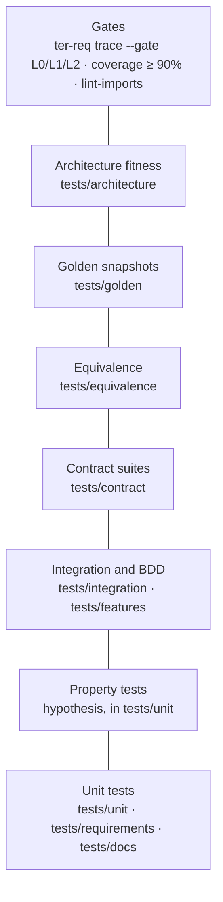

# Testing guide

TER's tests do more than catch regressions. They freeze TER 3's behaviour
while it is rebuilt, hold every adapter to its port's contract, keep the
architecture's dependency rule, and prove each EARS requirement. This guide
walks through each layer, the gates CI runs, and how to write a new test from
requirement to passing gate.

## The pyramid in this repository



| Layer | Where | Roughly how many | What it proves |
|---|---|---:|---|
| Unit | `tests/unit/` | 1,400 | One module's behaviour: TER 3 modules (`test_classifier.py`, `test_waste.py`, …) and TER 4 (`test_ter4_*.py`) |
| Property | `tests/unit/test_ter4_lean_properties.py`, `test_ter4_stream_properties.py` | (in unit) | Invariants over generated sessions (hypothesis) |
| BDD | `tests/features/**/*.feature` with steps in `tests/features/steps/*_steps.py` | 200 | TER 3 user stories in Gherkin (pytest-bdd) |
| Integration | `tests/integration/test_cli.py` | 12 | The `ter` CLI end to end on real files |
| Contract | `tests/contract/` | 100 | Every adapter of a port, real and fake, meets the same obligations |
| Equivalence | `tests/equivalence/test_live_static.py` | 24 | Live, event-by-event analysis equals batch analysis |
| Golden | `tests/golden/` | 110 | TER 3 scores, event streams, reports, Lean findings and A3s are frozen |
| Architecture | `tests/architecture/` | 2 | The import-linter contracts hold |
| Requirements tooling | `tests/requirements/` | 140 | The EARS lint, trace gate, points lint and `ter-req` CLI |
| Docs | `tests/docs/` | 40+ | README and docs links resolve, shown commands exist, the points index is fresh |

## Running tests

```bash
python -m pytest                                   # everything
python -m pytest tests/unit/test_ter4_lean_detectors.py -v
python -m pytest tests/golden tests/contract tests/architecture -q   # the L0 gate
python -m pytest -k "rework" -q                    # by name
python -m pytest tests/features/steps/core_steps.py -q               # one BDD module
```

`python -m pytest` uses the interpreter you installed into, which avoids
picking up a `pytest` from another environment. `pyproject.toml` sets
`pythonpath = ["src"]` and `--strict-markers`, so a misspelt marker fails.

### Tests that need the network

Two TER 3 dependencies download data on first use: tiktoken's `cl100k_base`
encoding and the sentence-transformers embedding model.

Tests that run the real embedding model carry the `embeddings` marker (in a
`.feature` file, the `@embeddings` tag): today 39 tests in
`tests/unit/test_input_analysis.py`, `tests/integration/test_cli.py` and the
intent scenarios under `tests/features`. Without the `embeddings` extra they
are skipped, each with the install command as its reason (`pytest -rs` lists
them). With the extra installed they run, and need the Hugging Face host for
the model. CI sets `TER_REQUIRE_EMBEDDINGS=1`, which turns the skip off, so a
missing model fails CI instead of hiding behind a skip. Mark any new test that
needs the real model the same way.

tiktoken falls back to a character estimate when it cannot download its
encoding, so those tests pass offline, slowly. Everything TER 4 does,
including every golden test, runs offline because it pins the deterministic
`RegexTokenizer` and `HashingEmbedder` adapters.

## Unit tests

Unit tests are plain pytest functions or classes, one file per module. TER 4
unit tests build event streams in code rather than reading files. The L2
detector tests use a small builder, `tests/unit/ter4_lean_builder.py`:

```python
@pytest.mark.req("TER-DET-002", "TER-DET-010")
class TestRepeatedToolCall:
    def test_identical_call_and_output_is_waste(self) -> None:
        s = Script()
        s.prompt("list things")
        s.bash("ls src", "a.py")
        _, first = s.bash("ls src", "a.py")
        [f] = found(s, "repeated_tool_call")
        assert f.confidence == 0.9 and not f.uncertain
        assert f.waste is LeanWaste.OVER_PROCESSING and f.kind is FindingKind.WASTE
```

Each detector has three kinds of cases: a positive one, a negative one, and
the boundary that separates them (for `rework_cycle`, a failure that *moves*
after a fix is iteration, not rework). Write all three for any new detector.

## Property tests

Where an invariant must hold for every session, not just the examples you
thought of, use hypothesis. `test_ter4_lean_properties.py` generates random
scripts of prompts, reads, edits, shell runs and handoffs, then checks that
every finding cites events that exist, confidence is bounded, uncertain
findings are exactly those below 0.70, and token sums add up:

```python
@settings(max_examples=150, deadline=None)
@given(scripts())
def test_findings_are_traceable_and_bounded(script: Script) -> None:
    a = explain(script.events, RegexTokenizer())
    ids = {e.id for e in script.events}
    for f in a.findings:
        assert f.evidence and set(f.evidence) <= ids
        assert f.uncertain == (f.confidence < UNCERTAIN_BELOW)
```

Keep `deadline=None` for anything that runs the full explainer, and keep
`max_examples` modest so the suite stays quick.

## BDD features

TER 3's user stories are Gherkin files under `tests/features/<area>/`, bound
to step definitions in `tests/features/steps/*_steps.py` with
`scenarios(...)`. `pyproject.toml` collects `*_steps.py` as test modules.

```gherkin
Scenario: Mixed alignment session produces valid TER with phase breakdown
  Given a completed session with the following spans:
    | phase      | tokens | aligned |
    | reasoning  | 200    | 160     |
  When the TER is calculated
```

Use BDD when a behaviour is best read by a non-developer as a scenario. New
TER 4 behaviour is usually better served by a unit or property test tagged
with its requirement.

## Golden snapshots

Golden tests freeze what TER computes on a fixed corpus: the sample session,
the fixture session and six synthetic sessions under `tests/golden/sessions/`
(see [tests/golden/README.md](../../tests/golden/README.md) for what each
exercises). For each session they snapshot:

| Snapshot | Content |
|---|---|
| `<name>.default.json`, `<name>.fine.json` | TER 3 analysis with default and fine span segmentation |
| `<name>.events.json` | The normalised `ter.event` stream |
| `<name>.stream.json` | The L1 `StreamReport` |
| `<name>.report.json`, `report/<name>.html` | The report view-model and HTML |
| `<name>.lean.json`, `<name>.a3.json`, `report/<name>.a3.html` | L2 findings, scorecard, evidence graph, the A3 view-model and page |

The tests pin TER 3's tokenizer and embedder to deterministic offline
adapters with the `pinned_models` fixture
([ADR 0002](../decisions/0002-hermetic-golden-characterisation.md)), so a
diff can only mean analysis logic changed.

### Changing a snapshot on purpose

A golden diff is a behaviour change. When you mean it:

```bash
TER_UPDATE_GOLDEN=1 python -m pytest tests/golden -q
git diff --stat tests/golden/snapshots
git diff tests/golden/snapshots/lean_mix.lean.json
python -m pytest tests/golden -q
```

Then review every changed number before committing:

- Does each change follow from your code change? A detector tweak should
  move that detector's findings and the scorecard, not TER 3 scores.
- Did anything change that should not have? A `*.default.json` diff from a
  report change means you touched analysis, not presentation.
- Commit the snapshot diff with the code that caused it, and say in the
  commit message which numbers moved and why. Reviewers read the diff.

To add a session, drop the `.jsonl` in `tests/golden/sessions/`, add its name
to `SYNTHETIC_SESSIONS` in `tests/golden/corpus.py`, and regenerate.
`test_corpus_integrity.py` fails on a missing snapshot or an orphaned one.

## Contract suites

A port's obligations are one test module under `tests/contract/`, run against
every adapter, real and fake, through a parametrised fixture. This keeps
fakes honest: a fake that drifts from the real adapter fails the same suite.

```python
@pytest.fixture(params=[_json, _memory], ids=["json", "in-memory"])
def book(request: pytest.FixtureRequest) -> PriceBook:
    factory: Factory = request.param
    return factory()


def test_unknown_model_raises(book: PriceBook) -> None:
    with pytest.raises(UnknownModelError):
        book.rate("no-such-model")
```

| Suite | Port | Adapters |
|---|---|---|
| `test_session_source.py` | `SessionSource` | `ClaudeCodeJsonlSource`, `GareRunSource` (mock runs and a real recorded run), `InMemorySessionSource` |
| `test_price_book.py` | `PriceBook` | `JsonPriceBook`, `InMemoryPriceBook` |
| `test_event_log.py` | `EventLog` | `JsonlEventLog`, `InMemoryEventLog` |
| `test_ter_scorer.py` | `TerScorer` | `Ter3Scorer` (offline), `FixedTerScorer` |
| `test_event_ingest.py` | `EventIngest` | `ObserveEvent` (no log, in-memory, JSONL), `RecordEvent` (the hook's append-only ingest) |
| `test_ingest_wiring.py` | `EventIngest` wiring | every CLI path (transcript, GARE run, event log, explain, hook) applies its events through the composition root's `EventIngest` |
| `test_hook_payloads.py` | hook payload shapes | fixtures in `tests/fixtures/hooks/` |

When you add an adapter, add its factory to the fixture's `params`. When you
add an obligation to a port, write it in the port's docstring and as a test
here.

## Equivalence tests

`tests/equivalence/test_live_static.py` replays every corpus session one event
at a time (as hooks would deliver it, including every event twice) and
asserts the live report and the live Lean explanation equal the batch ones,
including at intermediate prefixes. This is TER-ANL-010: live and batch share
one semantics. Any change to `AnalysisEngine` or the Lean fold must keep it
green.

## Architecture fitness

`tests/architecture/test_import_contracts.py` runs import-linter against the
contracts in `pyproject.toml` and checks the expected contracts are declared.
Run `lint-imports` for a readable report of any broken chain. See the
[architecture guide](architecture.md#the-dependency-rule).

## Requirement tracing

Every TER 4 behaviour is an EARS requirement (see the [EARS guide](ears.md)).
Tests say which requirement they verify:

```python
@pytest.mark.req("TER-ANL-010", "TER-OBS-004")
@pytest.mark.parametrize("name", sorted(CORPUS))
def test_live_with_redelivery_through_the_log_equals_batch(name: str) -> None:
    ...
```

The root `conftest.py` registers the `ter.adapters.driving.pytest_req` plugin,
which adds `--req-trace`:

```bash
python -m pytest --req-trace=req-trace.json
ter-req trace --results req-trace.json --gate L0
ter-req trace --results req-trace.json --gate L2
ter-req report --results req-trace.json --out coverage.md
```

`ter-req trace` fails when a `verified` requirement at or below the gate has
no passing citing test (forward trace), or when a test cites an id that is
not in the catalogue (backward trace). It also lists `planned` requirements
that already have a passing test, ready to promote. `ter-req lint --tests
tests` catches unknown ids statically, without running the suite.

## Documentation tests

`tests/docs/test_docs.py` keeps these guides honest, offline and in under a
second:

- every relative link in `README.md` and `docs/**/*.md` names a file that
  exists and, for Markdown targets, a heading anchor that exists
  (TER-REQ-007);
- every `ter`, `ter-req` and `python -m ter` command in a fenced shell block
  in the README, the guides, `docs/ter4/` and the hooks guide names a real
  subcommand and real options, checked against the argparse `--help` of each
  subcommand; nothing in the example is run (TER-REQ-008);
- `docs/ter4/points.md` equals the index generated from
  `requirements/points.yaml` (TER-REQ-005).

If you document a command, write it in a `bash` block so the check sees it.
Use `text` for output.

## Coverage

Branch coverage is on and `pyproject.toml` sets `fail_under = 90` over both
packages:

```bash
python -m pytest --cov=ter_calculator --cov=ter --cov-branch --cov-report=term-missing
```

New `ter` code should be close to fully covered by the tests that verify its
requirements; defensive fallbacks and presentation paths may sit lower.

## What CI runs

`.github/workflows/ci.yml` has three jobs.

| Job | Step | Command |
|---|---|---|
| Lint and type-check | Ruff format | `ruff format --check src tests` |
| | Ruff lint | `ruff check src tests` |
| | Mypy | `mypy src/` |
| | Architecture import contracts | `lint-imports` |
| | EARS requirements and vision points lint | `ter-req lint --tests tests` |
| | Vision points index is up to date | `ter-req points --check` |
| Python 3.11, 3.12, 3.13 | L0 gate | `python -m pytest tests/golden tests/contract tests/architecture -q` |
| | Tests with branch coverage | `python -m pytest --cov=ter_calculator --cov=ter --cov-branch --cov-report=term-missing --cov-report=xml --req-trace=req-trace.json` |
| | Traceability gates (3.11 only) | `ter-req trace --results req-trace.json --gate L0` (then L1, L2) |
| Package | Build and smoke test | `python -m build`, `twine check`, install the wheel, `ter --help` |

Run the same locally before pushing (the [contributing guide](contributing.md)
has the full checklist):

```bash
ruff format --check src tests
ruff check src tests
mypy src/
lint-imports
ter-req lint --strict --tests tests
ter-req points --check
python -m pytest --req-trace=req-trace.json
ter-req trace --results req-trace.json --gate L2
```

`--strict` also fails on warnings (proof that exists only on an unmerged
branch), which CI will hit once that branch merges.

## Writing a new test end to end

Suppose you are adding a rule: an edit to a file the agent then deletes is
wasted. The full path from idea to gate:

1. **Find the vision point** it serves in
   [docs/ter4/points.md](../ter4/points.md) (search the text, or the level's
   section). Note its id, for example `P020`.
2. **Write the requirement** in the file for its level, `status: planned`,
   with `source_points` naming the point, and add the id to that point's
   `rules` in `requirements/points.yaml`:

   ```yaml
   - id: TER-DET-011
     pattern: event-driven
     text: >-
       When the agent deletes a file it edited earlier in the same prompt, the
       waste detector shall report the earlier edits as overproduction.
     level: L2
     source_points: [20]
     rationale: Work that is thrown away did not advance the outcome.
     status: planned
   ```

3. **Lint it**, then regenerate the index:

   ```bash
   ter-req lint --tests tests
   ter-req points
   ```

4. **Write the tests first**: positive, negative and boundary, tagged with
   the id. They fail until the detector exists.

   ```python
   @pytest.mark.req("TER-DET-011")
   class TestDeletedWork:
       def test_edit_then_delete_is_overproduction(self) -> None:
           s = Script()
           s.prompt("tidy up")
           s.edit("src/tmp.py")
           s.bash("rm src/tmp.py", "")
           [f] = found(s, "deleted_work")
           assert f.waste is LeanWaste.OVERPRODUCTION
   ```

5. **Implement** until they pass. Add a property if an invariant is involved,
   and a synthetic golden session if the behaviour is visible in reports;
   regenerate snapshots with `TER_UPDATE_GOLDEN=1` and review the diff.
6. **Promote**: set `status: verified` on the requirement, update the
   point's `status` and `verification` honestly (see the
   [definition of done guide](definition-of-done.md)), and run
   `ter-req points`.
7. **Run the gates** listed above, then commit naming the point and
   requirement ids.

From then on, CI fails if that test stops passing or loses its tag.
