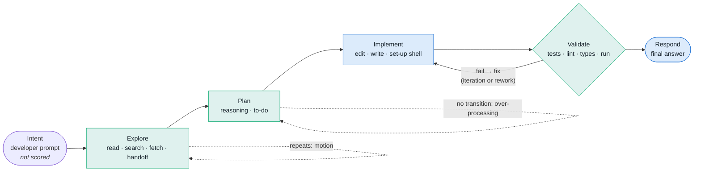

# L2 Explained: the Lean model, evidence and the A3

At L2 TER says *why* a session was inefficient, not only how much. Every
event in a session is placed on an agentic value stream and classified as
value-adding, necessary but non-value-adding, or avoidable, against the
developer's current intent. Sixteen detectors look for Lean wastes, each finding cites the events it rests on, and an A3
report turns findings into countermeasures: lines for `CLAUDE.md`, Claude
Code hooks and settings. All of it is computed from the session's event
stream alone; repository evidence arrives at L3.

The model and its trade-offs are recorded in
[ADR 0004](../decisions/0004-lean-waste-model.md).

## The agentic value stream



| Stage | Events | Default class (basis `stage:…`) |
|---|---|---|
| Intent | `intent.stated` | none: developer input is never scored |
| Explore | `fs.read`, `fs.search`, `net.fetch`, `agent.handoff`, exploring shell (`ls`, `git status`, `grep`) | necessary non-value-adding |
| Plan | `reasoning`, `plan.todo` | necessary non-value-adding |
| Implement | `fs.edit`, `fs.write` (value-adding); changing or other shell (`pip install`, `git commit`) | value-adding / necessary NVA |
| Validate | shell recognised as a check: test runners, linters, type checkers, build, ad-hoc `python -c` | necessary non-value-adding |
| Respond | `response`: the last one before the next prompt delivers the outcome; `route.failover`: a model call that failed on its way to a response; `route.escalated`: a recorded escalation to another model | value-adding (final) / necessary NVA (narration, failed route, escalation) |

Other routing markers (`route.selected`, `attempt.started`,
`verification.completed`, `outcome.recorded`) and task or subagent ends are
not steps. A tool result belongs to its request's stage. Wall time is the gap each event
closes: the gap before a tool result is the tool's running time and belongs
to its request; every other gap belongs to the event it precedes.

A confident waste finding reclassifies the share of each event it claims as
**avoidable**; an uncertain one moves that share to a separate **uncertain**
bucket; the rest keeps its stage class. `Classification.basis` names the rule
or finding id behind every event's class.

## Detector catalogue

Detectors live in `ter/domain/lean/detectors.py`, behind the `WasteDetector`
protocol, registered in `DEFAULT_REGISTRY`. Findings below confidence 0.70
are **uncertain**: shown, never suppressed, never counted as waste.

Detectors are plugins (TER-ARC-002). Each built-in detector is also the
capability `WasteDetector.<id>` in the registry of ADR 0005, and an installed
package adds one with an entry point:

```toml
[project.entry-points."ter.capabilities"]
"WasteDetector.my_detector" = "my_pack.detectors:MyDetector"
```

`ter.bootstrap.detector_registry()` runs the catalogue in its order, then
each installed detector by key; one that fails to load, lacks a member of the
protocol, or reuses a running detector id is left out and listed by
`python -m ter capabilities`. Analysers (`TerScorer.<name>`) and agent
adapters (`SessionSource.<name>`, chosen by a static `accepts(ref)`) load the
same way. Repository engines (TER-ARC-007) and policies (TER-ARC-008) follow
at L3 and L4.

| Detector | Lean waste | Evidence it cites | Confidence rule | Countermeasure |
|---|---|---|---|---|
| `repeated_tool_call` (pts 19, 39) | over-processing | both calls and results | within one prompt's turn: 0.90 same input and output, nothing edited between; 0.85 validation re-run without edits; 0.75 edits between but identical output. 0.50 an output not observed, or a new prompt between the two calls (calibrated on real sessions: 13 of 13 confident repeats crossed a prompt, such as a turn-ending call made once per turn, and none was waste). Different output: none | CLAUDE.md "reuse results"; PreToolUse(Bash) hook blocking identical commands on an unchanged tree |
| `repeated_exploration` (18, 28, 36) | motion | both reads/searches and results | 0.85 same arguments, identical output, file not edited between; 0.55 output not observed. Re-read after an edit or of another range: none | CLAUDE.md "do not re-read"; a "Where things live" map; PreToolUse(Read) hook blocking unchanged re-reads |
| `rework_cycle` (26, 37) | rework | failed run, failure, fix edits, next run | same command, edits between: 0.80 when the next run fails with the same failure signature, 0.90 for the second in a row. Pass or different failure: iteration, no finding | CLAUDE.md "same failure twice → stop and re-diagnose"; PostToolUse(Bash) hook flagging an identical failure |
| `unvalidated_implementation` (25) | defects (risk) | unvalidated edits and the response | per prompt, after a response: 0.85 no check in the session; 0.75 checks only earlier; 0.50 docs only; 0.85 responded after a failing check. A check is a validation run, or any shell line that runs a named check tool beside a change (`sed -i … && pytest`, `ruff check && git commit`; real sessions chain checks this way) | CLAUDE.md "validation is part of done" with the session's own test command; PostToolUse(Edit\|Write) hook running it |
| `premature_implementation` (22, 23) | defects (risk) | the prompt and the edit | 0.75 in-place edit of a file never read, written, named in an earlier shell command (`cat f`, `sed -n 1,80p f`) or named in output; 0.45 new file before any exploration | CLAUDE.md "read before editing"; `permissions.defaultMode: plan` |
| `excessive_planning` (8, 24) | over-processing | the planning run | ≥ 4 planning steps with no action between; 0.55 + 0.05 per step, ≤ 0.90; a step beyond the second is waste only when it adds no decision (reasoning ≤ 25% new words, or a repeated to-do update); no restating step, no finding | CLAUDE.md "act after planning"; plan-mode practice |
| `fragmented_edits` (27, 28) | motion | the edits and results | consecutive edits to one file (only reasoning and their own results between) over ≥ 3 round trips; a round trip ends when a result arrives, so edits sent together in one turn (parallel calls) count once; 0.70 + 0.05 per extra round trip, ≤ 0.85; only the results of edits after the first round trip are waste | CLAUDE.md "plan the change to a file, then send its Edit calls together in one turn" (Claude Code has no multi-edit tool: one Edit changes one string) |
| `unused_context` (21, 34, 35) | inventory | the read and its result | after a response, nothing later names the file or what it defines: 0.65 (defines names) or 0.55 — always uncertain at L2 | CLAUDE.md "read with a purpose"; verify first, then map or `/compact` |
| `unnecessary_handoff` (29, 30) | handoffs | handoff, result, the agent's own call | a later own call shares ≥ 3 key words with the handoff's task and covers ≥ 50% of the task's words: 0.45 + 0.40 × coverage, ≤ 0.85. Overlap with the smaller set flagged an orchestrator's every short review or merge command against its long worker briefs | CLAUDE.md "when to delegate"; `permissions.deny: ["Task"]` for small tasks |
| `repeated_reasoning` (8, 17) | over-processing | both reasoning blocks | same prompt, no edit between, ≥ 3 shared words, ≤ 25% new words, none of them from a tool result seen since (new evidence): 0.85 − novelty (− 0.10 under 6 words) | CLAUDE.md "act instead of restating" |
| `regeneration` (20) | overproduction | earlier write or read, the rewrite | whole-file write keeping ≥ 80% of the agent's own earlier write: 0.80; ≥ 60% of a file just read: 0.60 | CLAUDE.md "Edit, not Write, for existing files"; PreToolUse(Write) hook |
| `intent_drift` (6, 7, 48) | overproduction | the prompt in force, the agent's "also …" reasoning, the edit and result | edit or write scoring below the drift band (0.25) against an intent of ≥ 3 key terms, no intent change recorded: 0.85 continues a goal the developer dropped, or the agent called it additional; 0.55 (uncertain) only defines names the intent does not mention (calibrated on real sessions: 17 of 17 such findings were the requested change or helper scripts), or only added words (≥ 3) depart | CLAUDE.md "propose extra work, do not do it"; say wanted extras in the prompt |
| `excessive_context` (21) | inventory | the prompt, the context items, the first edit | per task, distinct context items before the first edit > 3 × files changed + 3: 0.55 + 0.02 per item over, ≤ 0.65 — always uncertain at L2; items past the band that are not reads of a changed file are waste | CLAUDE.md "name the files first"; verify, then a "Where things live" map |
| `insufficient_context` (22) | defects (risk) | the prompt, the items, the edit | per task, the n-th distinct file edited in place with fewer than 1 × n context items: 0.70; 0.55 when the file was read or written in an earlier task | CLAUDE.md "evidence for every file changed"; `permissions.defaultMode: plan` |
| `unused_traversal` (28) | motion | the search or walk and its result | after a response, a Grep/Glob or `ls`/`find`/`tree`/`rg` whose listed file names nothing later reads, edits or names: 0.60 — always uncertain at L2; empty output and repeats are not findings | CLAUDE.md "search for a target"; layout map |
| `failed_route` (29, 30) | waiting | the `route.failover` and the response that did the work | a model call that failed over: 0.80 when a later response did the work on another route, 0.55 when none did; its wall time is the waste | demote or health-check the failing route; timeout and circuit breaker |
| `unearned_escalation` (30) | waiting | the earlier response, the escalation and the escalated response | a `route.escalated` (or a re-attempt another model served) after a completed response of the task, with no new file read, check result or tool output before the next prompt: 0.80; 0.60 for a re-attempt (uncertain); 0.50 with no escalated response (uncertain). TER-DET-011, [L3](l3-grounded.md#escalation-without-new-evidence-ter-det-011) | escalate only on evidence in the routing profile; hand the stronger model new evidence |

The context band (`ContextBand`: `min_per_file` 1, `per_file` 3, `slack` 3)
is structural: it counts distinct context items (a file read once whatever
its ranges, each distinct search, fetch, handoff or exploring shell command)
in the task, from the prompt in force, against the files the task changes.
Pass `ExcessiveContext(band=...)` or `InsufficientContext(band=...)` in a
custom `DetectorRegistry` to change it. A reasoning span or planning step
*adds a decision* when more than 25% of its content words
(`DECISION_NOVELTY`) are new to the prompt and the reasoning it is compared
with, and *adds evidence* when a new word comes from a tool result observed
since; such a span is never waste (TER-LEN-004).

### Calibration on real sessions

Detectors are calibrated against real Claude Code transcripts: run
`python -m ter explain` (or `scripts/corpus_findings.py` over an imported
corpus), read the events each confident finding cites and judge it. A rule
with false positives is fixed structurally or its branch is lowered below
0.70, with the evidence in a code comment. On this project's own cloud
transcripts (one orchestrator session and its worker subagents, 2026-10)
the largest confident detectors of a 286-session private corpus
measured:

| Detector | Confident before | True | Cause of the false positives | Fix | Confident after |
|---|---|---|---|---|---|
| `repeated_tool_call` | 13 | 0 | identical call in separate turns: a turn-ending tool once per turn, a status re-check when asked again, a tool schema re-loaded after compaction | a new prompt between the calls makes it 0.50 (uncertain) | 0 |
| `unnecessary_handoff` | 5 (+4 uncertain) | 0 | parallel workers given long briefs; the orchestrator's later `sed -n` or merge shared a few words of each brief, which overlap with the smaller set counted as a match | coverage of the delegated task's words | 0 |
| `premature_implementation` | 1 | 0 | file read with `cat` in the shell before the edit | shell command words count as seen | 0 |
| `unvalidated_implementation` | 0 | – | none here; 15 of 260 check-running shell lines chained the check after a change and read as changes, which would hide the check | named check tools anywhere in a shell line count as a check; `gh pr checks`, `gh run watch/view` and `pre-commit run` are validation | 0 |
| `fragmented_edits` | 4 | 0 | 3 or 4 Edit calls to one file sent in one turn (parallel tool calls), counted as 3 or 4 round trips | count round trips, not calls: a result between two calls ends a round trip; a run continues past the results of its own earlier edits | 0 |

The sample is small and from one project, so these are precision fixes, not
a precision estimate; the private corpus counts are the next check.

The shared event ids (TER-OBS-007) changed what the detectors see. Before
them, parallel tool calls of one assistant message (one transcript record
each, one API message id) were merged into one message and given one id per
kind, so the engine, idempotent by event id, kept only the first: on these
transcripts 161 of 1,205 tool requests (13%; 10 edits, 5 writes, 6 reads, 98
shell calls) were silently dropped. With every call keyed by its
`tool_use_id`, parallel edits became visible as separate calls, which is why
`fragmented_edits` rose (16 to 72 confident on the private corpus) until it
counted round trips; `regeneration` and `repeated_exploration` rose for the
same reason (more writes and reads are seen), with no confident finding of
either here to judge.

On the private corpus (286 sessions, 9 Oct 2026) the round-trip rule took
`fragmented_edits` from 72 confident findings in 49 sessions back to 17 in
13, close to its count before the id change (16); every other detector's
counts were unchanged.

#### First judged sample (10 Oct 2026)

The owner judged 122 findings from the private corpus (one judge, at most 15
per detector, spread across sessions): every confident finding of the three
largest confident detectors, and up to 10 uncertain findings of each
detector that had any. Each verdict is true waste, not waste or unsure.

| Detector | Kind | True | Not waste | Unsure | Change |
|---|---|---|---|---|---|
| `regeneration` | confident | 14 | 1 | 0 | a rewrite under 30% of whose new file repeats old content is new work: no finding (`REGENERATED_SHARE`) |
| `repeated_exploration` | confident | 10 | 0 | 0 | none |
| `fragmented_edits` | confident | 15 | 0 | 0 | none |
| `excessive_context` | uncertain | 10 | 0 | 0 | none yet (see below) |
| `unnecessary_handoff` | uncertain | 10 | 0 | 0 | none yet |
| `unused_context` | uncertain | 10 | 0 | 0 | none yet |
| `unused_traversal` | uncertain | 10 | 0 | 0 | none yet |
| `intent_drift` | uncertain | 6 | 0 | 4 | none: score 0.00 was waste, 0.12 to 0.20 unsure |
| `insufficient_context` | uncertain | 5 | 0 | 5 | none: zero context was waste, some context below the band unsure |
| `premature_implementation` | uncertain | 2 | 0 | 0 | none |
| `repeated_reasoning` | uncertain | 3 | 3 | 0 | at most 20% new key words, was 25% (`RESTATED_NOVELTY`; 80% or more repeated was waste, 76% to 79% not) |
| `repeated_tool_call` | uncertain | 0 | 4 | 0 | a repeat across a new prompt is no finding (17 of 17 judged so far were not waste) |
| `unvalidated_implementation` | uncertain | 2 | 8 | 0 | one or two documentation edits are no finding (`DOC_EDITS_WORTH_A_CHECK`) |

Confident findings held up: 39 of 40 true, and the one false is the
rewrite that was mostly new content. Read the table with three limits in
mind. There was one judge. The cut-offs that separated true from not waste
for the uncertain rows (30% repeated, 80% key words, 3 documentation edits)
were proposed while judging and accepted, not compared with alternatives.
And ten findings per detector bound precision only loosely: 10 of 10 true
gives a 95% lower bound near 0.72. The four uncertain detectors with 10 of
10 true therefore stay uncertain until a second judge or a larger sample
(issues #36, #41) confirms them.

## Exploration drivers

`LeanAnalysis.exploration` (`exploration` in the JSON) labels every
exploration request (TER-DET-009, point 38). Questions are the sentences
ending in `?` in the task's prompt, reasoning and responses; they stay open
until the next prompt.

| Label | Rule | `motive` |
|---|---|---|
| `uncertainty_driven` | the request (its arguments, or a path's name or stem) names a word of an open question recorded before it | the question's event |
| `intent_directed` | otherwise, it names a word or file of the prompt in force | the prompt |
| `aimless` | neither | none |

A label never changes an event's activity class: exploration stays necessary
non-value-adding unless a waste detector claims it.

Validation outcomes are read from tool output with specific markers
(`FAILED`, `N failed`, `Traceback`, `error:`, `exit code N`…); anything else is
*unknown* and forms no cycle. Failure signatures hash the failing lines with
timings, addresses and timestamps removed.

## Intent and alignment

`ter/domain/lean/intent.py` keeps one **intent record** per session
(TER-ITN-001). Every `intent.stated` event adds a revision, so the history is
kept:

| Relation | When | Intent terms after |
|---|---|---|
| `opened` | the first prompt | the prompt's key terms |
| `acknowledged` | fewer than 2 goal terms (`ok`, `thanks`) | unchanged |
| `changed` | a sentence opens with a redirect (`Actually`, `Instead`, `Forget`, `New task`…) and the prompt scores below 0.5 against the intent or drops something; or, unmarked, ≥ 3 goal terms scoring below 0.2 | the prompt's goal terms |
| `refined` | otherwise | intent ∪ prompt, minus dropped terms |

Terms in a sentence that drops something (`forget the median`) are recorded as
*abandoned*. A change is an `IntentChange` naming the prompt that caused it
(TER-ITN-002).

**Key terms** are content words, identifier parts (`ValueError` → `valu`,
`error`) and file-name parts, lightly stemmed, without stopwords or generic
programming words. An edit's or write's subject is the names it defines that
were not there before, else the words it adds; other events use their text or
arguments.

**Alignment** (TER-ITN-004): every agent event (reasoning, tool request,
response) gets a score in [0, 1] against the revision in force, from an
injected `AlignmentScorer` (port in `ter.ports.driven`). The default,
`LexicalAlignment`, is the overlap coefficient of the two term sets;
`ter.adapters.driven.alignment.EmbeddingAlignment` scores the same terms with
any `Embedder`. Bands: aligned ≥ 0.5, partial ≥ `low_below`, low below it;
unknown when either side has no terms.

**Low-alignment periods** (TER-ITN-005): `min_events` (default 3) or more
consecutive scored agent events below `low_below` (default 0.25), with no
prompt between; unknown scores neither extend nor break a run. A period is a
report, not waste.

**Drift** (TER-ITN-003) is the `intent_drift` detector: an edit or write that
departs from the intent in force with no change recorded. Its finding claims
the edit, so a change the developer did not ask for is not value-adding
(TER-LEN-003). Departures in exploration and reasoning show only as low
alignment unless the session is grounded: with `--repo`, L3 tells relevant
exploration from drift (TER-ITN-006, TER-LEN-009,
[l3-grounded.md](l3-grounded.md#exploration-drift-ter-itn-006-point-48)). `IntentConfig(low_below, min_events, drift_below)` holds the
thresholds: similarity bands and counts of events, never token counts.

The timeline is `LeanAnalysis.intent`; the JSON carries it under `intent`
(and the A3 JSON under `background.intent`): revisions, changes, per-event
alignment, low-alignment periods and drift finding ids, each citing event
ids. The A3 page shows it as the intent timeline in Background.

## Scorecard (no single opaque score)

The scorecard has six separate dimensions (`ter.domain.lean.scorecard`,
TER-SCR-001), each a list of named measures with units; an unknown measure is
`null`/"unknown", never 0. The first five measure agent behaviour and come
from the analysis alone; *outcome* is judged apart from them
([outcome.md](outcome.md)). The A3 JSON carries them under
`analysis.dimensions`, and the A3 page as the "Scorecard dimensions" table.

| Dimension | Measures |
|---|---|
| Efficiency | TER, **Software Value Efficiency**, value-adding share and avoidable share of generated tokens |
| Flow | Agentic flow efficiency by tokens and by time, peak WIP (and the event it follows), WIP at the end |
| Quality | Validation runs, runs that passed and failed (read from their output), iteration and rework cycles, share of edits covered by a later validation run |
| Cost | Generated and context tokens, agent time, avoidable generated tokens, context tokens and time |
| Risk | Risk findings, uncertain findings, edits no validation run covered, failing checks never seen passing again |
| Outcome | The verdict (`accepted`, `rejected`, `incomplete`, or `unknown` without evidence), generated tokens per verified outcome |

Definitions of the headline measures:

| Measure | Definition |
|---|---|
| Agentic flow efficiency (tokens, time) | Share of generated tokens (agent wall time) *progressing* or *recovering* (productive iteration), against *repeating*, *reworking*, *waiting* (unnecessary handoffs) and *inventory* (unused context). Only confident findings move tokens out of progress. |
| Activity classes | Generated tokens and time by value-adding, necessary NVA, avoidable, uncertain. Sums equal the totals. |
| Waste cost | Avoidable generated tokens, context tokens re-entering the window, and seconds. |
| TER | The TER 3 ratio with the method used (`--ter offline` pins the deterministic tokenizer and embedder; `--ter model` uses sentence-transformers). |
| Software Value Efficiency | See below; reported next to TER in the A3 tiles, the A3 JSON (`analysis.scorecard.software_value_efficiency`, the key after `ter`), `explain --json` and the `explain` text. |
| Findings | Confident, uncertain and risk counts; iteration and rework cycles. |
| Composite | Only with its composition: the unweighted mean of flow efficiency (tokens), flow efficiency (time) and TER, whichever exist. |
| Context inventory | Tokens of retrieved context no later event used (the reads `unused_context` names, always uncertain, so inventory and never avoidable) and of context read more than once (every read of a path after its first; those after an edit of the file are marked `changed`), each with the model turns that carried it (TER-DET-004). |
| Session cost | With a price book, every model turn and the context inventory priced at the prices in force on the session date, marked estimated with reasons (TER-ANL-040, TER-ANL-041). |

### Context inventory and dated cost

`ter.domain.lean.inventory.context_inventory` measures the inventory and
`ter.domain.costing.price_session` prices it; the A3 JSON carries both as
`context_inventory` and `cost`, and the page shows them as scorecard tiles.

- **Session date.** The UTC date of the first timestamped event. Every turn
  is priced with the price book entry whose `effective_from` is the latest not
  after it (an entry dated exactly on the session date applies; a session
  dated before a model's first entry leaves that turn unpriced). Prices are
  data in `src/ter/data/price_book.json`, read through the `PriceBook` port
  (ADR 0003).
- **Model.** `ter.event/0.4` records the model on each turn's usage
  (`TokenUsage.model`), so a session is priced from its events alone. A turn
  whose model has no price is counted in `unpriced_turns` and named in
  `unpriced_models`, never guessed.
- **Carrying cost.** A context item is paid for on the first model turn after
  it entered (cache-write rate when that turn shows cache activity, else the
  input rate) and on every later turn (cache-read rate, else input). This
  assumes the context is kept until the session ends; compaction is not seen.
  Context tokens are the tokenizer's count of the tool output, not provider
  figures.
- **Estimated.** `cost.estimated` is true, with `estimate_reasons`, when a
  turn's usage had no cache fields (`TokenUsage.cache_reported` is false:
  GARE exports, or Claude Code records without them), when the session has no
  usage, no timestamp (the latest prices are used), or unpriced turns.
  Reconciling these figures with real billing is issue #40.

### Software Value Efficiency

SVE (point 81, TER-SCR-003) is value delivered toward a *verified* outcome per
unit of resource consumed. Value-adding work is the Lean activity class above
(edits that change the software, the final response); the outcome verdict says
whether that work delivered anything.

| Verdict | Status | `tokens` | `time` | Per outcome |
|---|---|---|---|---|
| accepted | `measured` | value-adding generated tokens ÷ generated tokens | value-adding agent seconds ÷ agent seconds | `tokens_per_outcome` = generated tokens, `seconds_per_outcome` = agent seconds |
| rejected | `no_value` | 0 | 0 | none (no verified outcome) |
| incomplete, or no `--outcome` | `unknown` | none | none | none |

Value is never inferred from tokens: without outcome evidence SVE is
*unknown*, and the reason says so. Money cost waits for cost on the L2
scorecard, so resources are tokens and time.

### Value per unit of resource, never token count alone

Every efficiency judgement is a ratio of value (or progressing work) to the
resource spent (TER-LEN-005): flow efficiency, activity shares and SVE.
Counting every text three times as many tokens changes none of them, nor any
finding or the verdict; a session that used fewer tokens and delivered nothing
scores below one that delivered an accepted change. Token minimisation is not
a goal, and the A3 says so under the scorecard.

## Work in progress

`LeanAnalysis.wip` (`ter.domain.lean.wip`, TER-WIP-001, points 31 and 32)
counts unresolved work after every event, lifecycle events included, as a fold
inside the incremental analyser (O(1) amortised per event; batch equals live).

| Kind | Opens | Resolves |
|---|---|---|
| Edits | an `fs.edit` or `fs.write` request | the result of a validation run requested after it, whatever it says (a failure becomes WIP of its own) |
| Failures | a validation result read as failed, keyed by its normalised command | a later run of the same command that passes; a different command does not (L2 cannot tell which checks a command covers) |
| Tasks | each to-do item (`plan.todo` with a `todos` list) not `completed`, replaced by each new list; each `agent.handoff` request | the to-do list marking it completed; the handoff's result |
| Hypotheses | an exploration request (read, search, fetch, exploring shell) on a subject not already open: the file path, otherwise the tool kind and subject | an edit or write of that path (acted on), or the end of the turn (a new prompt or `task.completed`) |

An intermediate response does not end a turn. Unknown validation outcomes open
and close nothing. The report has the series (`[event_id, hypotheses, tasks,
edits, failures]` per event), the peak (first sample with the largest total),
the peak of each kind, the final sample and the event ids that opened every
item still open at the end. The A3 draws the series as a stacked chart with
the peak marked, adds a "Peak WIP" tile, and `explain` prints a WIP line.

## Lean concepts and their measures

`ter.domain.lean.concepts.LEAN_MEASURES` maps each Lean concept TER-LEN-006
names to at least one measure the code computes: a detector
(`detector:<id>`) or a field of the A3 JSON (`a3:<path>`). A test resolves
every path in a real A3 and looks every detector up in the registry; the A3
lists the map under "Evidence and method" and in its JSON (`lean_concepts`).

| Concept | Measures |
|---|---|
| Value | `a3:analysis.scorecard.activity_tokens.value_adding`, `a3:analysis.scorecard.software_value_efficiency.tokens` |
| Flow | `a3:analysis.scorecard.flow_efficiency_tokens`, `a3:analysis.scorecard.flow_efficiency_time` |
| Pull | `detector:unused_context` (context no later action pulled), `a3:analysis.wip.peak_by_kind.hypotheses` (exploration not yet pulled into an action) |
| WIP | `a3:analysis.wip.series`, `a3:analysis.wip.peak.total` |
| Queues | `a3:analysis.wip.peak_by_kind.edits` (changes queued behind the next check), `a3:analysis.wip.peak_by_kind.tasks` |
| Rework | `detector:rework_cycle`, `a3:analysis.scorecard.flow_tokens.reworking` |
| Defects | `detector:unvalidated_implementation`, `detector:premature_implementation`, `a3:analysis.wip.final.failures` |
| Waiting | `a3:analysis.scorecard.flow_seconds.waiting`, `detector:unnecessary_handoff` |
| Over-processing | `detector:repeated_tool_call`, `detector:repeated_reasoning`, `detector:excessive_planning`, `detector:fragmented_edits` |
| Motion | `detector:repeated_exploration` |

## Evidence graph

`LeanAnalysis.graph` (`ter.evidence/0.1`, exported with `--graph FILE`) has one
node per event (stage, activity class, label) and typed edges from the later
event to the earlier one it rests on: `completes`, `motivated_by` (an action
rests on the observation or prompt before it; an edit also on the last read of
its file and the prompt in force), `validates` (a check covers every edit
since the previous check), `corrects` (an edit after a failed check) and
`repeats` (established by a finding). `EvidenceGraph.ancestors(id)`
reconstructs how a change emerged.

## The A3

```bash
ter a3 session.jsonl --html a3.html --json a3.json --graph evidence.json
python -m ter a3 session.jsonl --html a3.html            # same command
python -m ter explain session.jsonl [--json]              # findings as text or JSON
```

One self-contained page (no scripts, no requests, light and dark themes,
prints on A3 landscape) in A3 order: **1 Background** (the developer's
prompts and a problem statement) · **Scorecard** (tiles with TER and SVE side
by side and peak WIP, then the six dimensions) · **2 Current state** (value
stream map: stages with steps, tokens, context and time; stages with
confident waste outlined in red with a badge; avoidable and uncertain shares
per stage) · **3 Analysis** (waste Pareto of generated tokens, each event
counted once under the finding the scorecard charged it to, so the bars add
up to the scorecard's waste; activity-class 100% bar, flow by
tokens and by time, WIP over the session, fail → fix cycles) · **4 Root causes** (findings with
confidence, cost and evidence event ids) · **5 Countermeasures** (per fired
detector: CLAUDE.md lines, hook settings and scripts, settings) · **6
Follow-up** (what to measure next run and where in the JSON).

## Requirements

The behaviour is specified by the EARS catalogue (`requirements/l2_explained.yaml`,
plus `TER-GRF-002` and `TER-GRF-003` in `l3_grounded.yaml`); tests cite those
ids with `@pytest.mark.req`. The ids this page used before the catalogue
existed map as follows.

| Former id | Catalogue id | Status | Verified by |
|---|---|---|---|
| TER-LEAN-001 | TER-LEN-001, TER-LEN-007, TER-LEN-002 | verified | `tests/unit/test_ter4_lean_analysis.py`, `test_ter4_lean_properties.py` |
| TER-LEAN-002 | TER-DET-001, TER-ANL-020 | verified | `test_ter4_lean_properties.py` |
| TER-LEAN-003 | TER-ANL-021 (threshold `UNCERTAIN_BELOW` = 0.70) | verified | `test_ter4_lean_properties.py`, `test_ter4_lean_analysis.py` |
| TER-LEAN-004 | TER-LEN-008 | verified | properties, `tests/golden/test_lean_snapshots.py` |
| TER-LEAN-010, 011, 019, 020 | TER-DET-002 (and TER-DET-010 for re-run validation) | verified | `tests/unit/test_ter4_lean_detectors.py` |
| TER-LEAN-012 | TER-DET-006 | verified | same, `iteration_converges` golden session |
| TER-LEAN-013, 014, 015 | TER-DET-005 | verified | `test_ter4_lean_detectors.py` |
| TER-LEAN-016 | TER-DET-007 | verified: `fragmented_edits` and `unused_traversal` are motion; unused traversals stay uncertain until L3 evidence | `test_ter4_lean_detectors.py`, `test_ter4_lean_context_motion_waiting.py` |
| TER-LEAN-017 | TER-DET-004 | verified: unused and re-read context in tokens | `test_ter4_lean_detectors.py`, `tests/unit/test_ter4_context_cost.py` |
| (new) | TER-ANL-040, TER-ANL-041 | verified: priced at the session date's prices; no cache fields → estimated | `tests/unit/test_ter4_context_cost.py`, `tests/contract/test_price_book.py` |
| (new) | TER-EXP-001 | verified: stream report and A3 (cost included) recomputed from a reloaded event log; the TER 3 ratio and outcome verdict are TER-EXP-002 (L3, verified) | `tests/equivalence/test_recompute_from_events.py` |
| TER-LEAN-018 | TER-DET-008, TER-DET-011 (L3) | verified: redone handoffs, failed routes (`route.failover`) and escalations that added no evidence (`unearned_escalation`) | `test_ter4_lean_detectors.py`, `test_ter4_lean_context_motion_waiting.py`, `test_ter4_unearned_escalation.py` |
| TER-LEAN-019 | TER-LEN-004 | verified: `excessive_planning` and `repeated_reasoning` never claim a step that adds a decision or new evidence | `test_ter4_lean_detectors.py` |
| (new) | TER-DET-003 | verified: `excessive_context` (uncertain) and `insufficient_context` against a configurable structural band | `test_ter4_lean_context_motion_waiting.py` |
| (new) | TER-DET-009 | verified: exploration drivers | `test_ter4_lean_context_motion_waiting.py` |
| TER-LEAN-030 | TER-GRF-002, TER-GRF-003 (TER-GRF-001 planned: decision nodes) | verified | `test_ter4_lean_analysis.py`, properties, `test_ter4_a3.py` |
| TER-LEAN-040 | TER-SCR-002, TER-FLW-001, TER-SCR-001 | verified | `test_ter4_lean_analysis.py`, properties, `test_ter4_wip_scorecard.py` |
| TER-LEAN-050 | TER-ANL-010 | verified | `tests/equivalence/test_live_static.py`, properties |
| TER-LEAN-060 | TER-ARC-002 (TER-ARC-007 verified at L3: repository engines, see [l3-grounded.md](l3-grounded.md); TER-ARC-008 planned: policies at L4) | verified | `tests/unit/test_ter4_plugins.py`, `test_ter4_lean_analysis.py` |
| TER-A3-001, 005 | TER-RPT-003 | verified | `test_ter4_lean_analysis.py`, `test_ter4_a3.py`, golden A3 JSON |
| TER-A3-002 | TER-RPT-004 | verified | `tests/unit/test_ter4_a3.py`, golden A3 HTML |
| TER-A3-003 | TER-RPT-005 | verified | `test_ter4_lean_analysis.py` |
| TER-A3-004 | TER-LEN-008 | verified | `tests/golden/test_lean_snapshots.py` |
| TER-A3-006 | TER-ANL-012 | verified | `tests/contract/test_ter_scorer.py`, golden TER check |
| (new) | TER-ITN-001, 002, 004, 005 | verified | `tests/unit/test_ter4_lean_intent.py`, `tests/contract/test_alignment_scorer.py`, golden `intent_shift` and `example_session` |
| (new) | TER-ITN-003 (edits and writes; TER-ITN-006 planned at L3 for exploration and reasoning) | verified | `test_ter4_lean_intent.py` |
| (new) | TER-LEN-003 (edits and writes; TER-LEN-009 planned at L3 for the other events) | verified | `test_ter4_lean_intent.py` |
| (new) | TER-WIP-001, TER-SCR-003, TER-LEN-005, TER-LEN-006 | verified | `tests/unit/test_ter4_wip_scorecard.py` |

Tests that only partly prove a planned requirement (TER-GRF-001) do not
cite it, so the
trace gate never suggests promoting it early; `requirements/points.yaml`
names those tests as the points' verification instead.

## Brief points: definition of done and navigation rule

Status: **done** at L2, **partial** (what remains, and at which level), or
**later**. The rule is what future changes must keep true. The generated
index, [points.md](points.md), is authoritative; where this table and the
catalogue review differ, the status here has been aligned with it.

| Pt | Status | Definition of done | Rule for long-term navigation |
|---|---|---|---|
| 3 | done | Value, waste, flow, quality, cost, risk and outcome are named scorecard dimensions (`Dimension`, `ScorecardDimension`) computed from recorded events and the outcome verdict | New measures join a `Dimension`, never folded into another |
| 6 | partial | Edits and writes are valued against the current intent (`intent_drift`, TER-LEN-003); other events need repository evidence (TER-LEN-009, L3) | Value is judged against the intent revision in force, never the first prompt alone |
| 7 | partial | Waste = cost claimed by a finding that did not advance the requested outcome; an edit departing from the intent is overproduction (TER-LEN-003); other events at L3 (TER-LEN-009) | A waste finding must cite what it consumed (`waste_events`) |
| 8 | done | Reasoning is waste only when restated with ≤ 25% new words and no new evidence, or a restating step in a 4+ step run without action; a step that adds a decision or evidence never is (TER-LEN-004) | Never flag reasoning by length |
| 9 | done | Flow efficiency counts productive iteration as flow; a test cuts every token count to a third at constant value and no efficiency judgement or verdict changes (TER-LEN-005) | No detector threshold may be a token count |
| 10 | done | Headline is flow efficiency and SVE, not token totals; the A3 names token minimisation as a non-goal | Reports lead with flow and outcome risk |
| 11 | done | `ter.domain.lean` + ADR 0004; concept-to-measure map in `concepts.py` | Lean concepts change only with an ADR |
| 12 | done | Every concept has computed measures in `LEAN_MEASURES` (table above); pull and queues are proxied by unused context and WIP at L2 | Map a new concept onto `LeanWaste`/`FlowState` or `LEAN_MEASURES` before adding a detector |
| 13 | done | Six-stage value stream, `STAGE_ORDER` | Stage order is fixed; new tools map onto an existing stage |
| 14 | done | Prompts, reasoning, tool calls, reads, edits, tests, responses are events with stages | Stages come from tool *kinds*, never native names |
| 15 | done | Three activity classes with a basis per event | Every classified event carries a basis |
| 16 | done | Token and time proportions per class, sums equal totals | Proportions are apportioned exactly (largest remainder) |
| 17 | done | `repeated_reasoning` | Restatement is measured against earlier reasoning *and* the prompt |
| 18 | done | `repeated_exploration` | Re-reads after an edit of that file are never waste |
| 19 | done | `repeated_tool_call` | Output must be compared, not only input |
| 20 | done | `regeneration` | Only whole-file writes retaining existing lines |
| 21 | done | `excessive_context` against the structural band (uncertain), `unused_context` | Stay uncertain until repository evidence exists |
| 22 | done | `insufficient_context` (band per task), `premature_implementation` (edit of unseen file) | Bands count context items, never tokens |
| 23 | done | `premature_implementation` | Risk findings claim no cost |
| 24 | done | `excessive_planning` | Structural run length, never reasoning tokens |
| 25 | done | `unvalidated_implementation` | Judged per prompt, only after a response |
| 26 | done | `rework_cycle` | Same command, edits between, same signature |
| 27 | done | `fragmented_edits` (motion) | Only overhead is waste, never the change |
| 28 | done | Repeated reads (`repeated_exploration`), fragmented edits and unused traversals (`unused_traversal`, uncertain) are motion | As 18; unused traversals stay uncertain until L3 |
| 29 | done | `unnecessary_handoff`, `failed_route` | The handoff is the waste; the agent's own call is kept |
| 30 | done | Failed routes (`route.failover`) and escalations after a completed call that added no evidence (`unearned_escalation`, TER-DET-011, L3) are *waiting* | Waiting is attributed only through findings; "adds evidence" is structural (new file read, check result or tool output) |
| 31, 32 | done | `WipTracker` counts unresolved hypotheses, tasks, edits and failures after every event; the A3 shows the series and its peak | WIP is a fold: O(1) amortised per event, batch equals live |
| 33 | later | The WIP–efficiency correlation needs the L6 dataset (issue #44) | A finding never fires on WIP alone without that evidence |
| 34 | done | `unused_context` (inventory) | As 21 |
| 35 | partial | Unused context in tokens and carrying cost at the session date's prices, estimated without cache fields; reconciliation with real billing waits on issue #40 | Context and generated tokens are reported separately |
| 36 | partial | Re-read context in tokens and carrying cost, as 35; real data waits on issue #40 | As 35 |
| 37 | done | `ValidationCycle.verdict` iteration vs rework; iteration is *recovering* flow | A converging cycle is never waste |
| 38 | done | `LeanAnalysis.exploration` labels uncertainty-driven, intent-directed and aimless exploration | Default for exploration is necessary NVA; a label never changes the class |
| 39 | done | Validation re-run without edits and identical output | Re-validation after edits is never duplicated validation |
| 40 | done | `evidence`, `waste_events`, `Classification.basis`; property tested | No finding without evidence ids that exist in the trace |
| 45 | done | `IntentRecord` in `ter.domain.lean.intent`, rebuilt from the session's events by the same fold as the analysis | One record per session; revisions are never rewritten |
| 46 | done | Every `intent.stated` event adds a revision (`opened`, `refined`, `acknowledged`, `changed`) | History is kept; the current intent is the last revision |
| 47 | done | `IntentChange` with the causing prompt's event id and reason | A change needs a stated goal (≥ 2 goal terms) |
| 48 | partial | `intent_drift` for edits and writes; departures after a change are judged against the new intent. Exploration and reasoning drift need L3 (TER-ITN-006) | Drift is never inferred from a prompt, only from agent changes |
| 49 | done | `Alignment` per agent event from an injected `AlignmentScorer` | Scorers satisfy the port contract; the rule is published |
| 50 | done | `LowAlignmentPeriod` from `IntentConfig(low_below, min_events)` | Thresholds are similarity bands and event counts |
| 71 | partial | Session-scope evidence graph; repository nodes at L3 | Edges always point from later to earlier events |
| 72 | partial | Actions link to motivating observations; decisions as such need L3 | `motivated_by` is structural (preceding observation) |
| 73 | done | `motivated_by` edges | As 72 |
| 74 | partial | Edits link to the prompt and last read of the file; requirement-level links at L3 | Edits always link to the prompt in force |
| 75 | done | `validates` edges | A check validates all edits since the previous check |
| 76 | done | `corrects` edges | Only edits after a *failed* check correct it |
| 77 | partial | `EvidenceGraph.ancestors`; no command prints the reconstruction yet | Graph export schema is versioned (`ter.evidence/0.1`) |
| 79 | done | Agentic flow efficiency (tokens and time) | Defined in this page; changes need an ADR |
| 80 | done | Flow states: progressing, recovering, repeating, reworking, waiting, inventory | Each `LeanWaste` maps to exactly one flow state |
| 81 | done | Software Value Efficiency defined above, computed from the verdict and shown next to TER; unknown without outcome evidence | Not approximated from tokens |
| 82 | done | Six separate scorecard dimensions; the composite shows its parts | No opaque single score |
| 83 | done | Efficiency, flow, quality, cost, risk and outcome | As 3 |
| 84 | done | `Composite` with components, weights and formula | A composite is never shown without its parts |
| 85 | done | Confidence on every finding with a published rule | Every detector publishes `confidence_rule` |
| 86 | done | Uncertain findings shown and bucketed separately | Uncertain never counts as avoidable |
| 91 | partial | Conservative structural thresholds; uncertain below 0.70; the precision floor needs real data (issue #41) | Prefer a missed finding to a false one |
| 139 | partial | Countermeasures derive from findings (TER-RPT-005); intervention policies are L4 (TER-INT-007) | No recommendation from a token threshold |

## Where the code lives

| Layer | Module |
|---|---|
| domain | `ter/domain/lean/`: `model.py`, `facts.py`, `steps.py`, `intent.py`, `detectors.py`, `graph.py`, `analysis.py`, `wip.py`, `scorecard.py`, `concepts.py`, `countermeasures.py`, `inventory.py`, `a3.py`; `ter/domain/costing.py`; `AnalysisEngine.explain()` and `explain_batch` in `ter/domain/stream.py` |
| ports | `TerScorer`, `PriceBook` and `AlignmentScorer` in `ter/ports/driven.py` |
| application | `ExplainSession` in `ter/application/explain.py` |
| driven adapters | `ter/adapters/driven/ter3/` (`Ter3Scorer`), `FixedTerScorer` fake, `ter/adapters/driven/alignment.py` (`EmbeddingAlignment`) |
| driving adapters | `ter/adapters/driving/reports/a3.py`, `explain` and `a3` in `ter/adapters/driving/cli.py`; `ter a3` delegates from the TER 3 CLI |
| tests | `tests/unit/test_ter4_lean_*.py`, `test_ter4_a3.py`, `test_ter4_wip_scorecard.py`, `test_ter4_context_cost.py`, `tests/contract/test_ter_scorer.py`, `tests/contract/test_alignment_scorer.py`, `tests/golden/test_lean_snapshots.py`, `tests/equivalence/test_live_static.py`, `tests/equivalence/test_recompute_from_events.py` |

## Known limits

- Validation outcomes are read from output text; `ter.event` has no
  error flag. Unknown outcomes form no cycle.
- Model names are matched to the price book exactly or by alias; a dated
  model id the book does not list (such as `claude-opus-4-1-20250805`) is
  unpriced until the book names it.
- Detectors run when an explanation is requested, in time linear in the
  session; the per-event fold stays O(1) amortised.
- Alignment is lexical by default: it sees shared words, not meaning, so
  exploration with unrelated names can form a low-alignment period, and drift
  is only confident when an edit defines names the intent never mentions.
- Hook-recorded sessions carry no reasoning or responses, so detectors that
  need them (planning, restated reasoning, unvalidated-before-response) stay
  silent on hook logs, and only prompts record open questions there.
- A failed route's wall time is the gap since the previous step, which can
  include routing overhead before the call.
