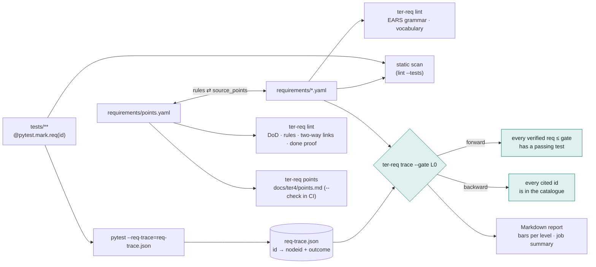

# TER 4 requirements control

Every TER 4 behaviour is a requirement written in EARS (Easy Approach to
Requirements Syntax), stored as YAML, traced to the tests that verify it and
gated in CI. A maturity level is claimed only when every requirement at that
level is verified by a passing test.

Above the requirements sit Leigh's 200 vision points (`requirements/points.yaml`).
Each point has a definition of done, the EARS requirements (rules) that
enforce it and its verification, and every requirement names the points it
serves. [points.md](points.md) is the generated, always-current index.
Points past P200 are contributed from another source (an external capability
such as GARE) and record an `origin`
([ADR 0005](../decisions/0005-admitting-external-capabilities.md)).

## Working rule for every TER 4 change

1. Name the point ids the change advances (`P044`, `P102`, …) in the commit
   message and the PR body.
2. Update `status` and `verification` of those points in
   `requirements/points.yaml` in the same PR, and regenerate the index with
   `ter-req points`.
3. A point becomes `done` only when its rules are verified by passing tests
   (or its verification names an existing test or CI check). `ter-req lint`
   rejects a `done` point without that proof.

## The catalogue

`requirements/` holds one file per maturity level (`l0_measured.yaml` to
`l6_learning.yaml`). A file's top-level `level` must match the level of every
entry in it.

```yaml
level: L1
requirements:
  - id: TER-OBS-004              # TER-<AREA>-NNN, unique
    pattern: unwanted            # ubiquitous | event-driven | state-driven | unwanted | optional | complex
    text: >-
      If the event store receives an event whose id it already holds, then the
      event store shall discard the duplicate without changing stored state.
    level: L1                    # L0..L6
    port: EventStore             # optional: the port the behaviour belongs to
    source_points: [119]         # vision points this realises (P001-P200, or a contributed one); must match points.yaml
    rationale: Hooks can fire twice; idempotent ingestion keeps counts exact.
    status: planned              # planned | verified
```

A requirement starts as `planned`. It becomes `verified` in the same change
that adds a passing test citing it. The gate enforces only `verified`
requirements, so planned ones document the road ahead without failing CI.

Areas in use: `ANL` analysis, `SRC` session sources, `OBS` observation,
`LEN` Lean model, `DET` waste detectors, `WIP` work in progress, `ITN` intent,
`SCR` scorecard, `RPT` reports, `FLW` flow, `EVD` repository evidence, `GRF`
evidence graph, `CTX` context bundles, `RTE` routing, `INT` interventions,
`CAL` calibration, `BEN` benchmarks, `RSH` research protocols, `EXP`
explanation, `OUT` outcome and acceptance, `SPC` process control (control charts), `ARC` architecture, `REQ` this control itself and the
documentation checks in `tests/docs`.

## Vision points

```yaml
points:
  - id: P119
    text: Ensure duplicate events do not distort analysis.   # verbatim
    level: L1
    kind: capability            # capability | principle | research
    status: done                # done | partial | not-started
    definition_of_done:         # 1 to 3 checkable statements
      - Re-delivered events are discarded without changing analysis state.
    rules: [TER-OBS-004]        # EARS requirement ids
    # issue: 35                 # optional: GitHub issue for work needing real session data
    # real_data: true           # blocks status done until real_data_verified: true
    verification:
      - 'test: tests/contract/test_event_ingest.py::test_redelivery_changes_nothing'
```

Verification entries take one of four forms:

| Form | Meaning | Checked |
|---|---|---|
| `test: <pytest node id>` | a test on this branch proves the point | file and every `::` name must exist |
| `ci: <step name>` | a CI step proves the point | a step with that name must exist in `.github/workflows` |
| `branch: <branch> <what>` | proof exists on an unmerged branch | warning until merged; `--strict` fails |
| `planned: <what>` | how the point will be verified | none |

**Real session data.** 46 points need data this repository cannot produce
(real sessions, annotations, benchmark runs, experiments). Each carries the
GitHub issue that collects it (`issue`, #34 to #46, tracked in #47) and
`real_data: true`. Such a point cannot become `done` on synthetic tests:
the lint rejects it until `real_data_verified: true` is set, which is done in
the change that closes the issue (the lint cannot query GitHub, so the flag
records the closure). Where an issue proposed a requirement id, the catalogue
uses that id.

Principles are enforced by an architectural rule whose verification is the
check itself (an import-linter contract, the golden gate, a lint). Research
points get a protocol requirement ("TER shall produce dataset X with fields
Y"), planned until the dataset exists.

## Controls



### 1. Grammar lint (`ter-req lint`)

`ter.domain.requirements` parses each text against the six EARS templates:

| Pattern | Template |
|---|---|
| ubiquitous | `The <system> shall <response>.` |
| event-driven | `When <trigger>, the <system> shall <response>.` |
| state-driven | `While <state>, the <system> shall <response>.` |
| unwanted | `If <condition>, then the <system> shall <response>.` |
| optional | `Where <feature>, the <system> shall <response>.` |
| complex | two or more clauses in the order Where, While, When or If |

It also checks that:

- the text has exactly one `shall`, starts with a capital letter and ends with a full stop;
- the declared `pattern` matches the pattern the text reads as;
- `then` appears after an If clause and nowhere else, and each clause is followed by a comma;
- the system name is at most six words (a longer one usually means a missing comma);
- no weak modal or unbounded word is used: should, may, might, could, must, fast, quickly, appropriate, efficient, user-friendly, easy, robust, optimal, and/or, TBD and similar. Say "within 50 ms at the 95th percentile", not "quickly".

Catalogue checks reject duplicate ids, malformed ids, levels outside L0-L6,
unknown fields and `source_points` outside 1-200.

**Controlled vocabulary (optional).** `requirements/vocabulary.yaml` maps
discouraged terms to preferred ones (`transcript: session`). The lint reports
each use, so the catalogue keeps one word for one concept.

`ter-req lint --tests tests` also scans the test tree for
`mark.req("...")` and fails on any id that is not in the catalogue.

### 2. Forward and backward trace (`ter-req trace`)

The root `conftest.py` registers `ter.adapters.driving.pytest_req`. With
`pytest --req-trace=req-trace.json`, it records every test that carries a
`req` marker and its outcome (`passed`, `failed`, `skipped`, `xfailed`,
`xpassed`, or `not-run` when deselected). A marker can cite several ids:
`@pytest.mark.req("TER-SRC-004", "TER-ANL-001")`.

`ter-req trace --results req-trace.json --gate L0` then fails when:

- **forward**: a `verified` requirement at or below the gate level has no
  passing citing test;
- **backward**: a test cites an id that is not in the catalogue.

It also lists planned requirements that already have a passing test, ready
to promote. `--summary PATH` appends the Markdown report; CI points it at
`$GITHUB_STEP_SUMMARY`.

### 3. Point lint and index (`ter-req lint`, `ter-req points`)

When `points.yaml` is present, `ter-req lint` also checks that:

- every point P001-P200 appears once, with 1 to 3 definition-of-done
  statements, at least one rule and at least one verification entry;
- every rule id exists, and links go both ways: a point lists rule R if and
  only if R's `source_points` contains that point;
- every requirement traces to at least one point;
- every `test:` and `ci:` entry names a check that exists;
- a `done` point has all its rules verified, or a `test:`/`ci:` entry that
  exists. Proof only on another branch is a warning (`POINT-PENDING`);
- a point with an `issue` has `real_data: true`, and a `real_data` point is
  `done` only with `real_data_verified: true` (`POINT-REAL-DATA`);
- P001-P200 record no `origin`, and every point past P200 records one with
  `source`, `ref` and `author` (`POINT-ORIGIN`, TER-REQ-009 and TER-REQ-010);
- every point a requirement cites is catalogued (`POINT-UNKNOWN`,
  TER-REQ-012).

`ter-req points` writes [points.md](points.md): counts by status and level
with bars, a 10 × 20 map (● done, ◐ partial, ○ not started) and one row per
point with its origin, issue link, definition of done, rules (✓ verified, · planned) and
verification. `ter-req points --check` fails CI when the committed file is
stale.

### 4. Maturity gate and report (`ter-req report`)

`ter-req report --results req-trace.json [--out coverage.md]` writes a
Markdown report with one row per level:

```text
| Level            | Coverage                    | Traced | Verified | Planned |
| L0 Measured      | ████████████████████ 100%   | 10/10  | 10       | 0       |
| L1 Observed      | ░░░░░░░░░░░░░░░░░░░░ 0%     | 0/3    | 0        | 3       |
```

`█` verified and traced, `▓` verified with no passing test, `░` planned. A
Mermaid pie chart of the status split, the vision-point grid and a table of
every requirement per level follow.

CI runs the gate at L0, L1, L2 and L3 ([strategy.md](strategy.md)). Raising the gate is the build side of claiming
a level; `Maturity.permits` is the runtime side. Each gate
checks only the requirements already verified at or below its level; planned
ones (today the L4 to L6 roadmap) do not fail it.

## Where the code lives

| Module | Role |
|---|---|
| `ter.domain.requirements` | `Requirement`, `EarsPattern`, grammar lint, forward/backward/point trace. Pure, no IO. |
| `ter.domain.points` | `VisionPoint`, `Verification`, the two-way point lint. Pure; existence checks are injected. |
| `ter.adapters.driven.requirements_yaml` | Loads the YAML catalogue, vocabulary and points; `RepositoryChecks` resolves `test:` and `ci:` entries. |
| `ter.adapters.driving.pytest_req` | Pytest plugin behind `--req-trace`. |
| `ter.adapters.driving.req_cli` | The `ter-req` command (also `python -m ter.adapters.driving.req_cli`). |
| `ter.adapters.driving.req_report` | Markdown rendering: coverage report and points index. |

The import-linter contracts forbid `yaml` and `pytest` in the domain, ports
and use cases, and keep `requirements_yaml` independent of the other driven
adapters.

## Adding a requirement

1. Add it to the file for its level with `status: planned`, with
   `source_points` naming the points it enforces, and add its id to those
   points' `rules` in `points.yaml`.
2. Run `ter-req lint` and `ter-req points`.
3. Write the test, tag it `@pytest.mark.req("<id>")`, make it pass.
4. Set `status: verified` in the same change. From then on, CI fails if that
   test stops passing or loses its tag.
