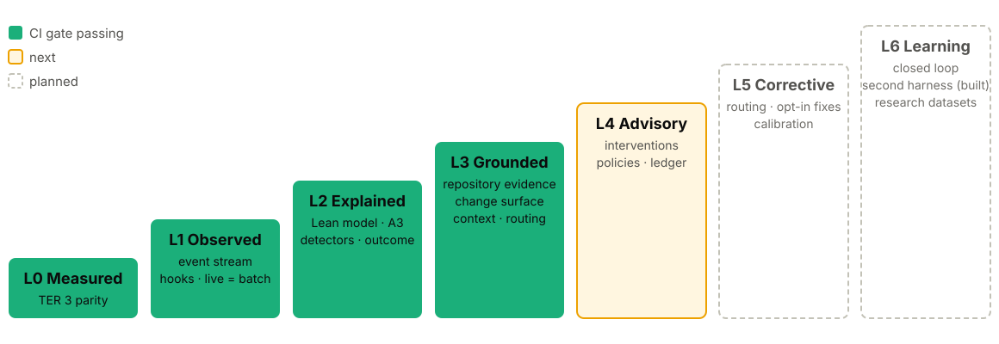

<!-- _class: lead -->
<!-- _paginate: false -->
<!-- _footer: "" -->

# TER

## Lean analysis for agentic software engineering

How efficiently did an agent turn a developer's intent into working software, where did it waste effort, and what should change so the next session wastes less?

`github.com/lgriffin/TER`

<!--
TER started as the Token Efficiency Ratio. TER 4 keeps that ratio and builds a Lean
analysis platform around it. This deck covers the intent, the Lean framing, the
engineering practices and where it is going. Everything shown as built exists on main;
anything planned is labelled planned.
-->

---

## The problem

Coding agents produce a lot of work. Most teams can only see the bill.

- A session is hundreds of reads, edits, shell calls and reasoning blocks.
- Token counts say **how much** was spent, not **what kind** of work it was.
- Nobody can say which part was value, which was necessary overhead, and which could have been avoided.
- Even when waste is visible, the fix is unclear: a prompt? a `CLAUDE.md` line? a hook? a setting?

> TER's aim: make the agent's process visible, name the waste with evidence, and turn it into concrete countermeasures.

<!--
The question is not "use fewer tokens". Fewer tokens are not automatically better and more
reasoning is not automatically waste. The question is whether the work moved the developer
toward the outcome they asked for.
-->

---

## Where TER came from: the Token Efficiency Ratio

**TER 3** scores model output only, never the user's prompts.

1. Load the transcript, merge sibling records, keep provenance.
2. Segment reasoning, tool use and responses into spans.
3. Build the intent from weighted prompt embeddings.
4. Classify each span as aligned or waste.
5. Compute TER per phase and as a weighted aggregate, `0 ≤ TER ≤ 1`.
6. Detect waste patterns and cost them with dated prices.

**The limit:** one ratio says how much was off-target. It cannot say *why*, or *what to change*. That is the gap TER 4 fills, without changing a single TER 3 score.

<!--
ter analyze still runs the TER 3 pipeline. TER 4 wraps it: golden snapshots freeze the
TER 3 scores, so the rebuild cannot drift them by accident.
-->

---

## Why Lean?

Lean asks of every activity one question:

> Does it add value the customer asked for, is it necessary but not itself valuable, or could it be avoided?

For TER:

- **The customer** is the developer.
- **Value** is the software outcome the developer requested.
- **Tokens are a cost**, not the goal.
- **Waste** has a type, a cause and a countermeasure, not just a size.

Lean gives a vocabulary that engineers and managers already share: value streams, flow, rework, waiting, the eight wastes and the A3.

<!--
Lean is the same thinking manufacturing and software teams use to find waste in a process,
applied to an agent's session. It turns "the agent was inefficient" into "the agent re-ran
the same check with nothing changed, here are the events, here is the hook that stops it".
-->

---

## The agentic value stream


Every event lands on one stage. A shell command is placed by what it does: `pytest` validates, `git status` explores, `pip install` implements.

<!--
Because stages come from tool kinds in the ter.event contract, the model carries over to
other harnesses. Developer prompts are the intent stage and are never scored.
-->

---

## Every event gets a class, and a reason

| Class | Meaning | Default for |
|---|---|---|
| **Value-adding** | Directly produces the requested outcome | edits and writes, the final response |
| **Necessary, non-value-adding** | Needed to produce value safely | exploring, planning, validating |
| **Avoidable** | Could have been skipped with no loss | the share claimed by a *confident* waste finding |
| **Uncertain** | A finding claims it below confidence 0.70 | shown, **never** counted as avoidable |

Every classification carries a `basis`: the stage rule or the finding id that gave the event its class. Any number in a report traces back to the events behind it.

<!--
The uncertain bucket matters. TER would rather miss a finding than make a false one:
anything below 0.70 confidence is shown so you can check it, but it never inflates the
waste numbers.
-->

---

## The eight wastes, as an agent commits them

| Lean waste | What it looks like for a coding agent |
|---|---|
| Rework | Changing work again because an attempt did not move a failing check |
| Motion | Re-reading files, re-running searches |
| Over-processing | Repeated calls, repeated reasoning, excessive planning, fragmented edits |
| Waiting | Blocked on another model, agent or external call |
| Inventory | Context acquired and carried but never used |
| Defects | Unvalidated or uninformed changes (risk findings) |
| Overproduction | Rewriting work that was already satisfactory |
| Handoffs | Delegating to a subagent, then doing the work anyway |

Each waste also moves time and tokens into a **flow state**, which gives flow efficiency.

---

## Waste detection: twenty detectors, all with evidence

- Detectors are plugins behind the `WasteDetector` protocol, registered in `DEFAULT_REGISTRY`.
- Each publishes its **confidence rule** in plain language.
- Each finding cites the **evidence events** it rests on and the events whose cost it claims.
- Thresholds are **structural**, never token counts: "the same check fails with the same signature after a fix", not "more than 500 tokens".

### Iteration is not rework

Fail, fix, a *different* failure, fix, pass: that is **productive iteration**, 100% flow efficiency, no findings. Only a failure that does not move after a fix is rework.

<!--
The detector catalogue. Seventeen run on every session: repeated_tool_call,
repeated_exploration, rework_cycle, unvalidated_implementation, premature_implementation,
excessive_planning, fragmented_edits, unused_context, unnecessary_handoff, repeated_reasoning,
regeneration, intent_drift, excessive_context, insufficient_context, unused_traversal,
failed_route, unearned_escalation. Three more join only when the analysis has the repository
(L3): unrelated_modification, surface_expansion, boundary_violation.
Each has unit tests with positive, negative and boundary cases.
-->

---

## What it looks like

```bash
ter explain tests/golden/sessions/lean_mix.jsonl
```

```text
TER explain · session golden-lean-mix
  flow efficiency  76% of generated tokens, 79% of agent time
  activity         value_adding 344 · necessary_non_value_adding 186 · avoidable 167 · uncertain 0
  findings         4 confident, 0 uncertain, 1 risk(s)
  - [0.80] overproduction: Rewrote src/retry.py in full · 138 tok · evidence 525128d61f9d3cdd, b5390d420b1defb6
  - [0.85] over_processing: Repeated validation run · 53 tok · evidence 1774d5b4e3612ff4, …
  - [0.90] over_processing: Repeated Bash call · 26 tok · evidence a583401c59d12ccd, …
  - [0.70] motion: 3 edits to src/net.py over 3 round trips · 22 tok · evidence e7fe263036935cb0, …
  - [0.85] defects: Responded after a failing check · risk · evidence 41d76c37c2c2c618, …
```

Confidence first, waste type, a plain-words title, its cost, and the event ids to check it.

---

## The A3: one page per run

<!-- _class: small -->


Lean's A3 walks a problem in order on one sheet. TER writes one per session.

1. **Background**
2. **Current state**: value stream map
3. **Analysis**: Pareto, activity, flow
4. **Root causes**, with evidence
5. **Countermeasures**
6. **Follow-up**: metric and target

Beside it, a **scorecard** of separate dimensions. No single opaque score.

<!--
ter a3 session.jsonl --html a3.html --json a3.json. The page is self-contained, no scripts
and no requests, works in light and dark, and prints on one A3 landscape sheet. Every number
on it is in the JSON. The screenshot is the real output for the synthetic lean_mix session.
-->

---

## Analysis and root causes


<!--
Left: the waste Pareto, the activity classes as a 100% bar, and flow by tokens and by time.
Right: every finding, largest cost first, with its Lean waste, confidence, cost and the
event ids it rests on. Risk findings such as "responded after a failing check" claim no
token cost.
-->

---

## Countermeasures you can apply today

<!-- _class: small -->


One block per detector that fired, most costly first. Four kinds of action:

- **Add to `CLAUDE.md`**: a standing instruction
- **Install a hook**: settings snippet and script
- **Harness setting**: e.g. plan mode
- **Practice**: for the developer

Lines are built from the session's own findings, such as the test command the agent actually ran.

---

## Plan, do, check, act

Each countermeasure is an **experiment**, not a rule.

1. **Plan**: read the A3, pick the costliest root cause.
2. **Do**: apply its countermeasure.
3. **Check**: run the next comparable session and compare the follow-up metric.
4. **Act**: keep it if the metric moved toward its target; remove it if not.

```bash
ter a3 before.jsonl --json before.json
ter a3 after.jsonl --json after.json
```

> A hook that fires often while flow does not improve is waste too. Remove it.

---

## Behaviour apart from outcome

Two questions, kept apart on purpose:

- **How did the agent behave?** Measured from the session's events: flow, activity, waste.
- **Is the resulting software correct?** A **verdict** from outcome evidence: `accepted`, `rejected` or `incomplete`.

```bash
ter a3 session.jsonl --outcome junit.xml --html a3.html
```

- The verdict reads test results (JUnit XML) through the `OutcomeSource` port.
- It is shown **beside** the Lean measures and never folded into them.
- No weighted outcome score: hand-set weights would hide which check decided the result.

<!--
Point 5 of the vision. A fast, tidy session that ships a broken change is not efficient,
and a messy session that lands a correct change is not a failure. Keeping the two apart
lets you see both.
-->

---

## Engineering: a hexagon, rebuilt by strangler fig


TER 4 wraps TER 3 and replaces it piece by piece. Every step ships and `ter analyze` keeps working.

<!--
ADR 0001: hexagonal strangler rebuild. The domain is pure: no TER 3 internals, no vendor
SDKs, no IO. Prices are data in a dated price book (ADR 0003), never hard-coded.
-->

---

## The rules are enforced, not described

| Rule | Enforced by |
|---|---|
| Dependencies point inward; the domain is pure | Eight `import-linter` contracts, `lint-imports` and `tests/architecture` |
| TER 3 scores never drift by accident | Golden snapshots; a scoring change is a committed snapshot diff |
| Every adapter honours its port | One contract suite per port, run against real adapters **and** fakes |
| Live analysis equals batch analysis | `tests/equivalence` on the golden corpus |
| New `ter` code is strictly typed | `mypy` overrides in `pyproject.toml` |
| Docs do not rot | `tests/docs`: links resolve, command examples name real options |
| Coverage does not slide | 90% branch coverage floor on Python 3.11 to 3.13 |

<!--
Leigh's rule of thumb: if it matters, a test or a CI step fails when it breaks.
ADR 0002 covers hermetic golden characterisation.
-->

---

## One event stream: transcripts and live hooks

- Transcripts and Claude Code hooks both become the same **`ter.event`** stream.
- Analysis is a **fold** over that stream: `AnalysisEngine.apply` is O(1) amortised and idempotent by event id, so **live = batch**.
- The capture hook maps `UserPromptSubmit`, `PreToolUse`, `PostToolUse`, `Stop` and `SubagentStop` into events, and **fails open**: it always answers `{}`.
- `--record DIR` keeps every raw payload, to calibrate the live path against real hooks.

```bash
python -m ter hook --record ~/ter-data/hooks < payload.json
python -m ter observe --event-log ~/.cache/ter/events
```

<!--
Failing open matters: a measurement tool must never break the developer's session.
Recordings hold tool inputs and outputs, so they stay outside the repository and are
redacted before sharing.
-->

---

## L3 Grounded: the repository behind the analysis

Up to L2, TER judges a session from its events alone. At L3 it also asks the **repository the agent worked in**, checked out at the session's start commit.

- One provider-neutral port, **`RepositoryEvidence`**: files, search, tests that import a module, symbols, imports, call edges, diff and history.
- Engines are interchangeable **capabilities**, each answering only what it can read and returning `None` rather than guessing:

| Engine | Reads |
|---|---|
| `lexical` | files, text search, test links: the deterministic baseline |
| `python-ast` | Python symbols, imports and call edges |
| `syntax` (default) | Python, TypeScript, JavaScript, Svelte and Vue imports and calls |
| `git` | the working-tree diff and each file's history |

Without `--repo`, every L2 command and its output is unchanged.

<!--
Every engine passes the same contract suite, on a Python repository and on a
TypeScript/Svelte monorepo. Evidence reaches the domain only through the port, enforced by an
import contract and an architecture test (TER-EVD-001).
-->

---

## The expected change surface

<!-- _class: small -->

For each task (a prompt and the work up to the next one), built from structure, never from token counts or word scores:

1. **Seeds**: the files the prompt names, by path, module or a symbol they define.
2. **Neighbours**: files a seed imports or is imported by.
3. **Tests**: test modules that import a seed or a neighbour.

Every edit is then placed **inside**, **expansion** (one import link out) or **unrelated** (no link). Added imports are checked against the repository's own `import-linter` or `dependency-cruiser` contracts.

```text
$ python -m ter explain session.jsonl --repo ../shop-at-start
  change surface   1 task(s); edits: 2 inside, 0 expansion, 1 unrelated, … 2 contract(s) from pyproject.toml
  evidence usage   1 read(s): 1 used (1 by a change, command or check), 0 unused (0 tok), 0 pending
  - [0.60 (uncertain)] overproduction: Edit outside the change surface: src/app/reports/summary.py · 56 tok
  - [0.90] defects: Import breaks contract layers: app.domain.model -> app.service.checkout · risk
```

<!--
The output is real, from the synthetic shop repository the L3 tests use: the prompt asked to
fix rounding in pricing.py, the agent also edited an unrelated report module and added an
import from the domain into the service layer. Seed choice also covers prompts that name no
file: they inherit the last named seeds when the intent says it is a refinement.
-->

---

## Grounded detectors, with honest confidence

| Detector | Lean waste | Kind | Confidence |
|---|---|---|---|
| `unrelated_modification` | Overproduction | waste | **0.60 at most**: always uncertain, a pointer for review |
| `surface_expansion` | Overproduction | waste | 0.60 at most: callers often must change with what they call |
| `boundary_violation` | Defects | risk | **0.90** when the bad import survives the session's last edit |

### Real data lowered the first claim

On 52 of Leigh's sessions, with each repository at its start commit, **0 of 29** judged `unrelated_modification` findings were truly unrelated: they were tests, CI, docs and modules the task implied but did not name.

So the confident case dropped from 0.80 to 0.60. An import graph is not the change surface; the rule earns confidence back only on a judged corpus with true positives.

<!--
This is the TER rule working as intended: a detector earns confidence on judged real
sessions, not by construction. Countermeasures in the A3: keep each task's edits inside its
surface, make ripple edits a stated decision, run lint-imports in a PostToolUse hook.
-->

---

## Context: what the agent read, used and lacked

<!-- _class: small -->

### Context bundles

Instead of letting the agent read its way to the evidence, TER can hand it a **bundle**: the evidence selected for the next decision, inside a token budget, each fragment with its reason.

```bash
python -m ter context bundle session.jsonl --repo ../repo-at-start --budget 4000 --out bundle.md
python -m ter context report session.jsonl --repo ../repo-at-start --critical critical.json
```

TER then measures it: **precision**, **recall**, recall of a critical-evidence list before the first dependent edit, unused context as **inventory** cost and missing context as **defect** risk.

### Evidence the session gathered

- **Evidence usage**: for each read, did a later decision, edit or test use it?
- **Outcome value**: each exploration, reasoning and validation step judged against what the intent required.
- **Drift**: exploration that leaves the intent and touches nothing the change depends on.
- **Evidence graph**: intent, observations, decisions, actions, changes and validation, linked.

<!--
Bundles are advisory at L3: they are built and measured, never injected into a live session.
The TER 3 context orchestrator was the inspiration; nothing of it is imported. Context recall
on real sessions still needs critical-evidence lists (issue #42).
-->

---

## Model routing, advisory

TER names which model **role** each task should have run on, and where it should have escalated.

- Models are referenced only by **role** (`explore`, `implement`, `review`, `escalate`); profiles are data.
- Each task is classed by complexity, ambiguity, risk, scope and validation needs, with evidence for each.
- Escalation needs a detector signal with evidence; otherwise the profile is kept.
- `unearned_escalation`: an escalation that added no new evidence is **waiting** waste.

```text
$ python -m ter route session.jsonl --repo ../shop-at-start
  task 0  steps 0-11  change  role implement -> escalate
    risk       high   edits outside its change surface …; breaks an architecture contract
    decision   boundary_violation (0.90) cites 2 event(s) of the task: escalate implement -> escalate
```

**Advisory and offline:** below L4 the router never answers a hook or changes a live session.

<!--
An architecture test checks that no ter module spells a model id in a string literal
(TER-RTE-001), and test_no_intervention checks that every hook still answers {} below L4.
-->

---

## Maturity levels: L0 to L6

<!-- _class: small -->



A level is claimed only when **every** requirement at that level is verified by a passing test. **TER 4 is at L3 Grounded**: CI gates L0, L1, L2 and L3, so main cannot slip back. The level is also a runtime ceiling: below L4, TER delivers no intervention at all.

| | L0 | L1 | L2 | L3 | L4 | L5 | L6 |
|---|---|---|---|---|---|---|---|
| Requirements verified | 25/25 | 22/22 | 54/54 | **34/34** | 0/16 | 0/10 | 11/19 |

<!--
Counts from requirements/l*.yaml on main, 146 of 180 in all. The L6 requirements already
verified are the ones that did not have to wait: the GARE second harness and the stack
comparison. The ceiling is ter.domain.Maturity.permits, checked by
tests/architecture/test_no_intervention.py (TER-INT-001).
-->

---

## Requirements control: EARS, traced to tests

- Every behaviour is an **EARS** requirement in `requirements/*.yaml`, written in one of six templates, such as *"When ‹trigger›, the ‹system› shall ‹response›."*
- Requirements start `planned` and become `verified` only when a passing test cites them: `@pytest.mark.req("TER-DET-002")`.
- Every requirement traces up to Leigh's **200-point vision**; every point has a **definition of done**.
- CI lints the grammar, then traces forward and backward and fails the gate on a gap.

```bash
ter-req lint --tests tests
ter-req trace --results req-trace.json --gate L3
ter-req points --check
```

**Today:** 146 of 180 requirements verified; 101 points done, 43 partial, 56 not started.

<!--
Requirements and points move in the same PR as the code. A point is done only when its rules
are verified by tests. docs/ter4/points.md is generated, and CI fails when it is stale.
-->

---

## Real data, redacted first

Claims about real agent behaviour need real sessions. Synthetic tests prove the rules; real sessions show whether they are the right rules.

- **The rule:** 47 points depend on real data and can **never** be marked done from synthetic tests alone.
- **The corpus importer** redacts secrets, paths and file contents *before* anything is written; nothing raw is ever committed.

```bash
python -m ter corpus import ~/.claude/projects --out ~/ter-data/corpus
python -m ter hook --record ~/ter-data/hooks < payload.json
```

<!--
The importer writes a per-session redaction report and a manifest; project names become
stable pseudonyms. Content-free summaries reach the repository, never sessions.
-->

---

## What 286 real sessions taught us

<!-- _class: small -->

On 9 October 2026, TER ran over Leigh's own sessions.

| Check | Result |
|---|---|
| Record coverage, 286 sessions | **100%** of records mapped or documented, after fixes |
| Live hooks against transcripts | Every prompt, tool call and Stop matched on three real recordings |
| Confident L2 findings, one project | **23 claimed, 0 true**: each rule fixed structurally |
| `unrelated_modification`, 52 sessions | **0 of 29** truly unrelated: capped at 0.60, never counted |
| Outcomes, 61 sessions | Derived from commits and PRs: 29 merged, 4 closed, 24 no commit |
| Second harness | A real GARE run translated with token totals equal to GARE's |

> **Confident is a claim, and real data disproved most of the first claims.** A detector earns confidence on judged real sessions, not by construction.

<!--
Other lessons from strategy.md: event identity changes counts (giving parallel tool calls
their own ids moved fragmented_edits by a factor of four, then a round-trip rule brought it
back down); observational stack comparisons are confounded by repository; outcomes can be
derived from PRs with known blind spots. Still unproven on real data: per-category precision
as a number, context recall, escalation value, and GARE failover.
-->

---

## Open to other projects: capability packs

[ADR 0005](../docs/decisions/0005-admitting-external-capabilities.md): outside work enters TER as a **capability pack**, never as a second core.

| Part | Lives in |
|---|---|
| A **port**, with its obligations in the docstring | `ter.ports` |
| A **contract suite**, one test per obligation | `tests/contract/` |
| **EARS requirements**, linked to vision points | `requirements/*.yaml` |
| An **in-memory fake** that passes the suite | `ter.adapters` |
| One **reference adapter**, registered by entry point | `ter.capabilities` |

Coupling is by **file contract, not import**: adapters read another system's files by published schema name, so TER installs and tests without it.

---

## GARE integration

**GARE** records agent usage and governance data that overlaps TER's levels L1, L4 and L5. It is the first external project brought in through capability packs.

| Capability | Status |
|---|---|
| Outcome and acceptance verdict, `OutcomeSource` port with JUnit reference adapter | **Built** |
| Import rule: `gare`, `pydantic`, `httpx` forbidden in the domain and core | **Built**, enforced in CI |
| GARE as a second session source (`gare-run`), routing lifecycle events in `ter.event` | **Built**: L6 second harness verified |
| A real GARE run, with token totals equal to GARE's own export | **Checked** on one local-model run |
| Real failover across routes; tokens per verified outcome | Planned (issue #55) |

<!--
GARE's concepts are re-specified as EARS requirements, not vendored. New goals GARE brings
become points past P200 with a recorded origin; P001 to P200 stay Leigh's verbatim text.
The real run used a local model, and GARE skipped the dead route rather than failing over,
so failover is still unproven.
-->

---

## Next: L4 Advisory

TER tells the developer, **during** the session, what it sees and why, with the evidence. It changes nothing the agent reads, and records every piece of advice and what followed.

- **Intervention engine** reading only structured detector signals, never raw events.
- **Declarative policies**: evidence required, confidence threshold, cooldown, permitted action; approved by a human.
- **Guards**: no advice on token counts alone, below 0.70, in a cooldown, or for a waste category not yet judged on real data.
- **Ledger**: one record per intervention, then the developer's response and flow before and after.

**Shadow mode first**: replay recorded sessions, write what TER *would* have advised, judge it, and only then turn advice on.

<!--
Exit gate: all 16 L4 requirements verified, --gate L4 in CI, and test_no_intervention made
ceiling-aware: at L4 hooks may show user-facing messages, never additionalContext, a
decision or continue. Data needed from Leigh: verdicts on open confident findings, hook
recordings with advice on, a week or two of sessions with advice and whether it helped.
-->

---

## Where it is going

| Level | Adds | Status |
|---|---|---|
| **L3 Grounded** | Repository evidence, change surface, contracts, context bundles, advisory routing | **Met**, gated in CI |
| **L4 Advisory** | Intervention engine, declarative policies, an intervention ledger | Next |
| **L5 Corrective** | Annotation, agreement, precision and recall with confidence intervals, benchmarks, opt-in corrections | Planned |
| **L6 Learning** | Self-suspending policies, controlled experiments, research datasets | Second harness and stack comparison built |

Each level moves from describing waste to preventing it, and none acts on a session before the levels below it are shown right on real data.

<!--
Explain after the fact (L2), ground in the repository (L3), advise during the session (L4),
correct with consent where calibration shows it is safe (L5), and learn from the ledger of
what worked (L6). The full roadmap, entry criteria, exit gates and data needed per level are
in docs/ter4/strategy.md.
-->

---

<!-- _class: lead -->

## Signals, not verdicts

TER is a heuristic, decision-support tool. Its numbers are signals to investigate, not verdicts on a developer, a model or a session.

```bash
python -m pip install -e ".[dev]"
ter a3 tests/golden/sessions/lean_mix.jsonl --html a3.html
```

Guides: Lean · A3 · hooks · testing · EARS · architecture, all in `docs/guides`.

<!--
Try it on the synthetic sessions first; they are built to show particular wastes.
Then point it at your own sessions in ~/.claude/projects.
-->
